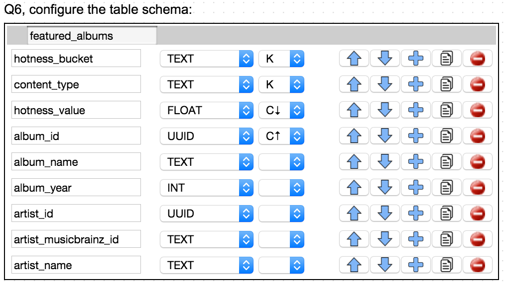
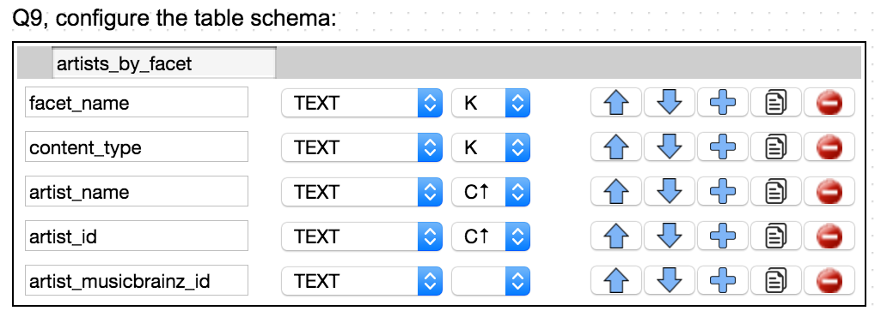
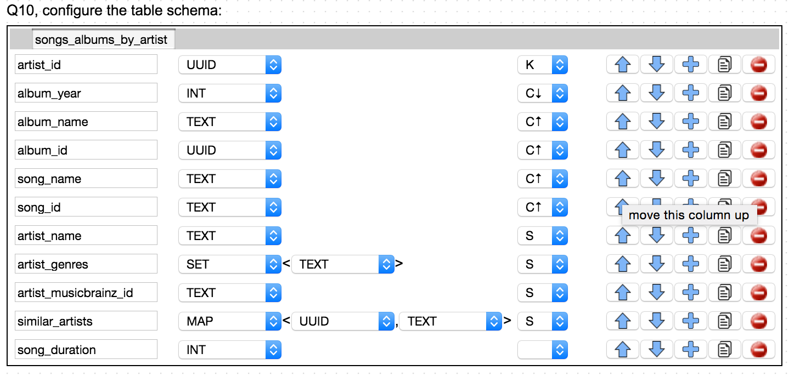
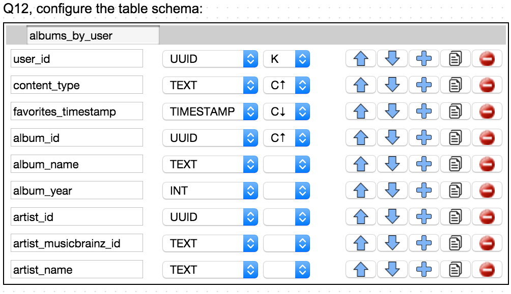
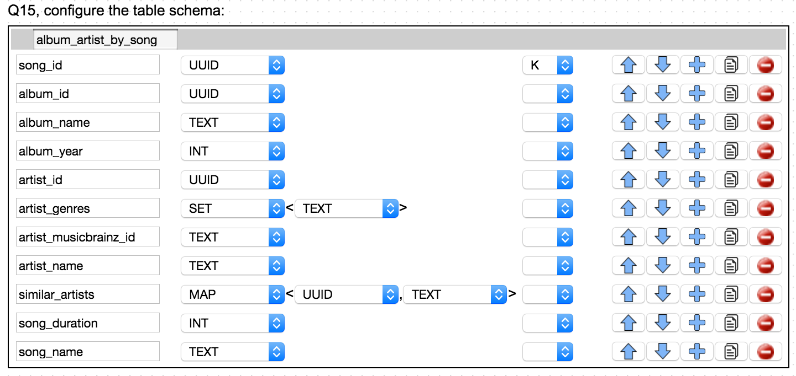

Kenzan Million Song Library - Database
======================================
Bill Schwanitz <bschwanitz@kenzan.com>
:Author Initials: WES
:toc!:
:icons:
:numbered:
:website: http://kenzan.com/

*Table of Contents*
[upperroman]
. link:MillionSongLibrary.html[General Information]
. link:Client.html[Client/UI]
. link:Server.html[Server]
. Database

'''

Introduction
------------
Due to the large about of data to be persisted, and the need for quick reads and linear scalable performance, the MSL project uses Cassandra as the back-end datastore, and the Datastax Java driver as the interface.

Design
------
The Kashlev Data Modeler (KDM) (http://kdm.dataview.org) was used to model the Cassandra schema. 

Entity-Relationship Diagram
~~~~~~~~~~~~~~~~~~~~~~~~~~~
Initially, we performed a traditional data analysis - looking at what entities are required based on the use cases, and what are the relationships between those entities.

.Entity Relationship Diagram
image:images/database/entity_relationship.png[Entity Relationship Diagram]

Access Patterns
~~~~~~~~~~~~~~~
We then used those same use cases to determine how the data in the entities would be accessed. Because of the use patterns of a Cassandra datastore, one must think in terms of queries when designing the schema. This is a difficult transition for those accustomed to building SQL schemas. Even more difficult is the need to denormalize the schema - sacrilege for SQL aficionados. There are many good tutorials and documents on-line dicussing this process.

.Access Patterns Diagram
image:images/database/access_patterns.png[Access Patterns Diagram]

Implementation
--------------
The following table includes the details for each query included in the access patterns diagram.

Note: fields marked with "K" are partition keys, and those marked with "C" are cluster keys.

.Queries 
[options="header"]
[width="100%",cols="2,4,12",options="header"]
|=======================
|Query Number	|Description			|
|Q1				|Users					|image:images/database/Q01 users.png[Users]
|Q2				|User ratings		|image:images/database/Q02 user ratings.png[User Ratings]
|Q3				|Average Ratings		|image:images/database/Q03 average ratings.png[Average Ratings]
|Q4				|Featured Songs			|image:images/database/Q04 featured songs.png[Featured Songs]
|Q5				|Songs by Facet			|image:images/database/Q05 songs by facet.png[Songs by Facet]
|Q6				|Featured Songs			|
|Q7				|Songs by Facet			|image:images/database/Q07 albums by facet.png[Songs by Facet]
|Q8				|Featured Artists		|image:images/database/Q08 featured artists.png[Featured Artists]
|Q9				|Artists by Facet		|
|Q10			|Songs/Albums by Artist	|
|Q11			|Songs by User			|image:images/database/Q11 songs by user.png[Songs by User]
|Q12			|Albums by User			|
|Q13			|Artists by User		|image:images/database/Q13 artists by user.png[Artists by User]
|Q14			|Songs/Artist by Album	|image:images/database/Q14 songs artist by album.png[Songs/Artist by Album]
|Q15			|Album/Artist by Song	|
|Q16			|Paging State			|image:images/database/Q16 paging state.png[Paging State]
|=======================

Data Import
-----------
The Million Song Library data is available from http://labrosa.ee.columbia.edu/millionsong/pages/getting-dataset. A 10,000 song subset of the full data set is also available at that link. Downloading the data yields a gzipped file that contains two directories: AdditionalFiles and data. The data directory has a bunch of subdirectories that contain an HDF file (with the extension h5) for each song in the database. The AdditionalFiles directory contains several files that summarize the dataset - these files will not be used for the import.

HDF or Hierarchical Data Format files (https://en.wikipedia.org/wiki/Hierarchical_Data_Format) contain all the data we need for albums, artists and songs. We use the Python library written by Thierry Bertin-Mahieux (tb2332@columbia.edu) to read these files. We tried using Java and the JHI5 (https://www.hdfgroup.org/products/java/JNI/jhi5/) but ran into issues with the native library aspect of that implementation so decided to defer the reading of the HDF files to python.

So, at a high level, the data import process uses python to traverse a given directory tree consuming all the .h5 files and creating a single CSV file with one line for each song. This CSV file is then consumed by a Java program to create the CSVs that will be inserted into the Cassandra cluster.

NOTE: The tags within an .h5 file (/metadata/artist_terms) essentially indicate the genre of the song. There are so many genres used in the dataset that it makes their use as a searching mechanism not particularly useful. So a list of genres is defined in Genre.java to declare which of the genres we are interested in persisting. Any genres not found in the list are ignored.
