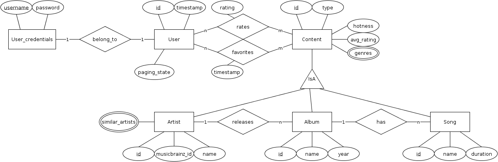
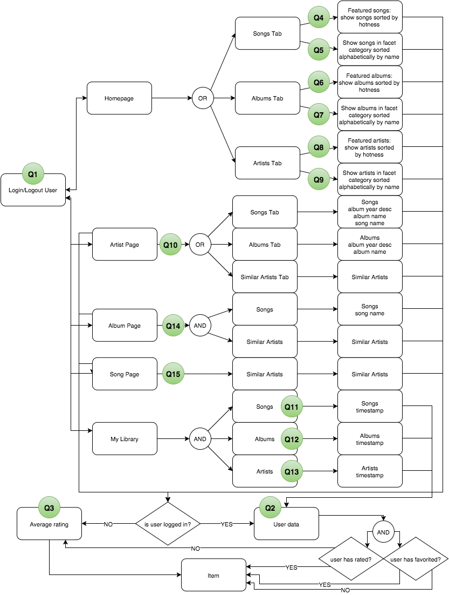

Kenzan Million Song Library Demonstration
=========================================
Bill Schwanitz <bschwanitz@kenzan.com>
:Author Initials: WES
:toc:
:icons:
:numbered:
:website: http://kenzan.com/

Introduction
------------
Some marketing-ish description of what MSL is and why Kenzan is
working on it

Tools
-----

API Documentation and Code Generation 
~~~~~~~~~~~~~~~~~~~~~~~~~~~~~~~~~~~~~
The Swagger open-source tool (http://github.com/swagger-api) allows
the team to unify the documentation of the API with the generation
of client and server code. This assures that the documentation
is always in sync with the code. Further, it allows the team to
publish the documentation in various formats. 

Documentation
~~~~~~~~~~~~~
The AsciiDoc open-source tool (http://asciidoc.org/) allows the team
to produce documentation that can then be formatted and published in 
a variety of formats. 

Client
------

Architecture
~~~~~~~~~~~~
[red]#TBA#: a diagram of the client architecture

Language(s) and Frameworks
~~~~~~~~~~~~~~~~~~~~~~~~~~
AngularJS
^^^^^^^^^
This project is a single page app built on the AngularJS framework (https://angularjs.org/). AngularJS is a flexible toolset that works well with other libraries.

Sass
^^^^
The project uses Sass (http://sass-lang.com), a CSS pre-processor, meaning that it extends the CSS language, adding features that allow variables, mixins, functions and many other techniques that allow you to make CSS that is more maintainable, themable and extendable. This project uses the SCSS syntax.

Material Design
^^^^^^^^^^^^^^^
At the root of this CSS and Angular architecture lies Google's Material Design (http://www.getmdl.io/). We are using the Angular Material (https://material.angularjs.org/) version of Material Design to leverage built in Angular components.

KSS Styleguide Generation
^^^^^^^^^^^^^^^^^^^^^^^^^
KSS (http://warpspire.com/kss/styleguides/) is a set of guidelines to help you produce an HTML styleguide tied to CSS documentation that is nice to read in plain text, yet structured enough to be automatically extracted and processed by a machine. It is designed with CSS preprocessors (such as Sass or LESS) in mind, and flexible enough to accommodate a multitude of CSS frameworks (such as YUI, Blueprint or 960).

ES2015
^^^^^^
This project leverages new JavaScript features available in ES2015. Babel (https://babeljs.io/) is used to transpile the JavaScript.

Webpack
^^^^^^^
Webpack (https://webpack.github.io/) is a module bundler. It is used to produce static assets from modules with dependencies.

Server
------

Architecture
~~~~~~~~~~~~
[red]#TBA#: a diagram of the client architecture

Language(s) and Frameworks
~~~~~~~~~~~~~~~~~~~~~~~~~~
The back-end server is written in Java - Enterprise Edition 1.8, to be exact. Communication between client and server is performed using a RESTful web service over HTTP. The REST code stubs, generated by Swagger (http://github.com/swagger-api), use JaxRs annotations (http://jax-rs-spec.java.net). Java's Jersey library (http://jersey.java.net) is used as the implementation of the JaxRs API. JUnit is used as out unit testing framework.

Portions of the Netflix OSS stack are used to provide cloud services. At its foundation, the server is based on Karyon (http://github.com/Netflix/karyon) - this enables the use of other useful Netflix OSS tools. For example, Archaius (http://github.com/Netflix/archaius) is used as the configuration manager allowing the service to react to changes in configuration parameters dynamically, and EVCache (http://github.com/Netflix/EVCache) is used as the highly available, distributed memory cache.

All data is persisted using Apache's Cassandra (http://cassandra.apache.org). Cassandra is a highly available, scalable NoSQL database. The DataStax Java driver (http://datastax.github.io/java-driver) is used to interface the Java code with the Cassandra database.

That is a *LOT* of information. Let's summarize...

.Server Languages and Frameworks
[width="80%",cols="6,^3,^3,8",options="header"]
|=======================
|Use                      |Name        |Vendor      |URL
|Language                 |Java EE 1.8 |Oracle      |http://www.java.com
|API Documentor/Generator |Swagger     |open-souce  |http://github.com/swagger-api
|ReST API                 |JaxRs       |Oracle      |http://jax-rs-spec.java.net
|ReST Implementation      |Jersey      |Oracle      |http://jersey.java.net
|Unit Testing             |JUnit       |JUnit       |http://junit.org/
|Cloud Infrastructure     |Karyon      |Netflix OSS |http://github.com/Netflix/karyon
|Configuration Management |Archaius    |Netflix OSS |http://github.com/Netflix/archaius
|Memory Cache             |EVCache     |Netflix OSS |http://github.com/Netflix/EVCache
|Database                 |Cassandra   |Apache      |http://cassandra.apache.org
|Database Driver          |DataStax    |DataStax    |http://datastax.github.io/java-driver
|=======================

Database
~~~~~~~~
.Entity-Relationship Diagram

.Access Patterns

.Queries
[options="header"]
|=======================
|Query Number |Description  |
|Q1           |Users by email    |image:images/Q1 users by email.png[Q1 Users by email]
|=======================

Data Import
~~~~~~~~~~~
The Million Song Library data is available from http://labrosa.ee.columbia.edu/millionsong/pages/getting-dataset. A 10,000 song subset of the full data set is also available from this page. Downloading the data yields a gzipped file that contains two directories: AdditionalFiles and data. The data directory has a bunch of subdirectories that contain an HDF file (with the extension h5) for each song in the database. The AdditionalFiles directory contains several files that summarize the dataset - these files will not be used for the import.

HDF or Hierarchical Data Format files (https://en.wikipedia.org/wiki/Hierarchical_Data_Format) contain all the data we need for albums, artists and songs. We use the Java HDF5 Interface (JHI5) (https://www.hdfgroup.org/products/java/JNI/jhi5/) to read these files.

So, at a high level, the data import program, written in Java, traverses a given directory tree reading and processing each file with an extension of "h5". The appropriate data is extracted from each file and inserted into the Cassandra cluster. Note: the tags withing a file (/metadata/artist_terms) essentially indicate the genre of the song. There are so many genres used in the dataset that it makes their use as a searching mechanism not particularly useful. So a properties file is used to declare which of the genres we are interested in persisting. Any genres not found in the properties file are ignored.
