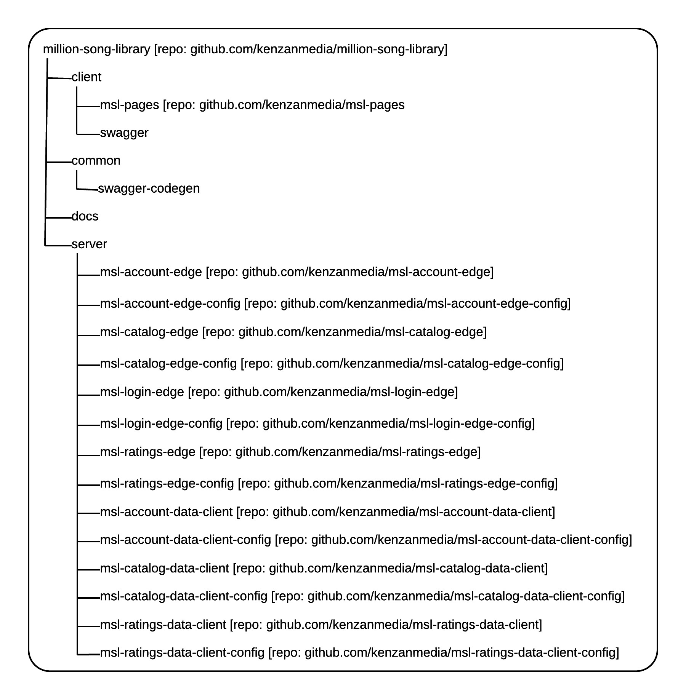

Kenzan Million Song Library Demonstration
=========================================
Bill Schwanitz <bschwanitz@kenzan.com>
:Author Initials: WES
:toc!:
:icons:
:numbered:
:website: http://kenzan.com/

*Table of Contents*
[upperroman]
. General Information
. link:Client.adoc[Client/UI]
. link:Server.adoc[Server]
. link:Database.adoc[Database]

'''

Introduction
------------
Some marketing-ish description of what MSL is and why Kenzan is working on it

GitHub Repositories
-------------------
The artifacts for this open source project are available from GitHub (http://github.com/kenzanmedia/million-song-library). This is the master repository for all the available artifacts. This master repo refers to most of its artifacts via multiple sub-repositories (git submodules) - one for each service, configuration, and UI service. Subdividing the repositories this way allows for easy configuration of our continuous integration (CI) jobs, while at the same time the master repository makes for easy retrieval of the entire project.

.Directory and Repository Diagram

Tools
-----

API Documentation and Code Generation 
~~~~~~~~~~~~~~~~~~~~~~~~~~~~~~~~~~~~~
The Swagger open-source tool (http://github.com/swagger-api) allows the team to unify the documentation of the API with the generation of client and server code. This assures that the documentation is always in sync with the code. Further, it allows the team to
publish the documentation in various formats. 

Documentation
~~~~~~~~~~~~~
The AsciiDoc open-source tool (http://asciidoc.org/) allows the team to produce documentation that can then be formatted and published in a variety of formats. 

Coding Standards
----------------
We have found the Google coding standards and style guides (https://google.github.io/styleguide/javaguide.html for Java, https://google.github.io/styleguide/javascriptguide.xml for JavaScript, and https://github.com/google/styleguide for implementations on various IDEs) to be concise and useful.

All code in this project has been written to comform to these standards.
