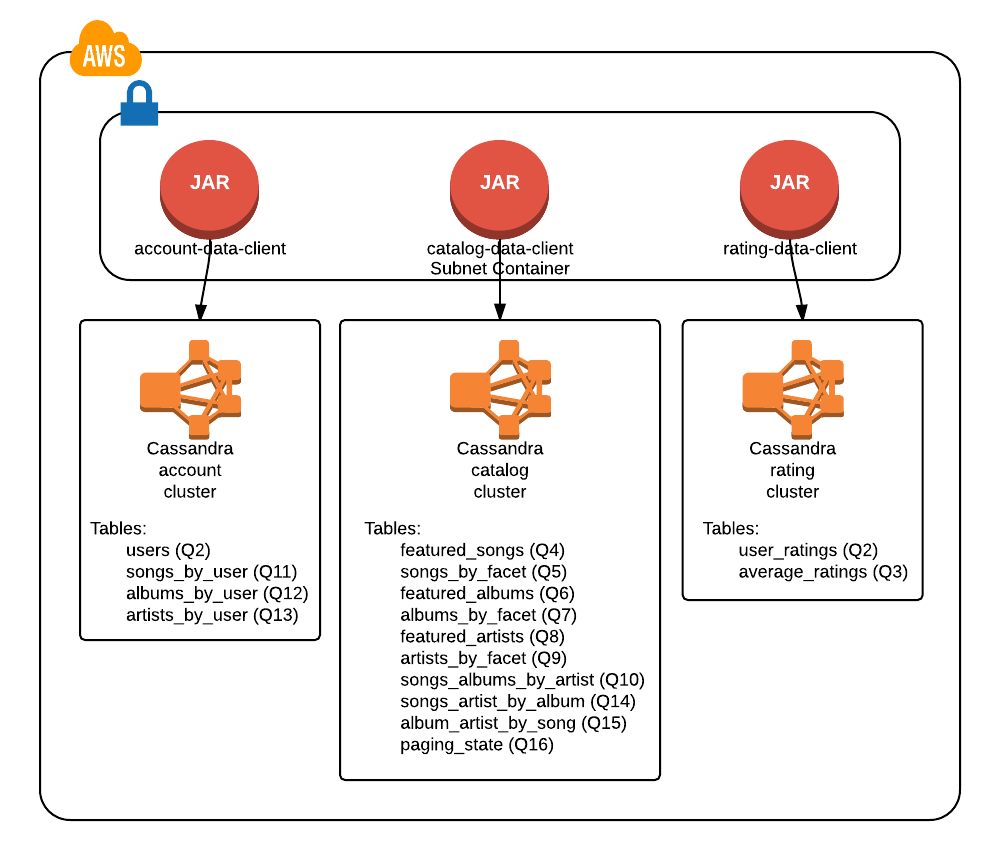
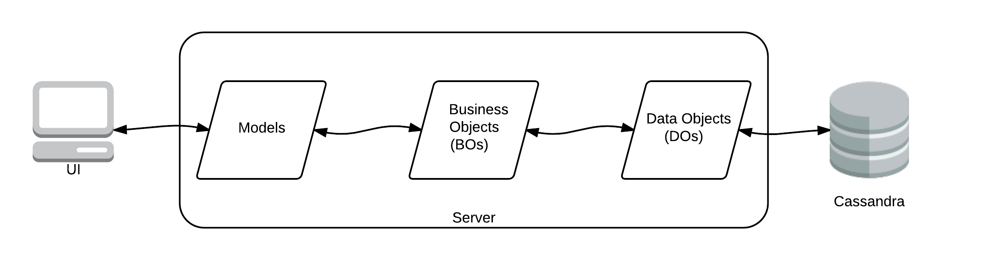
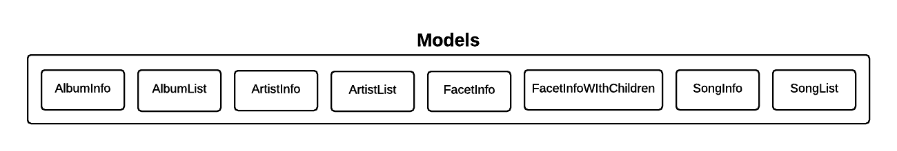
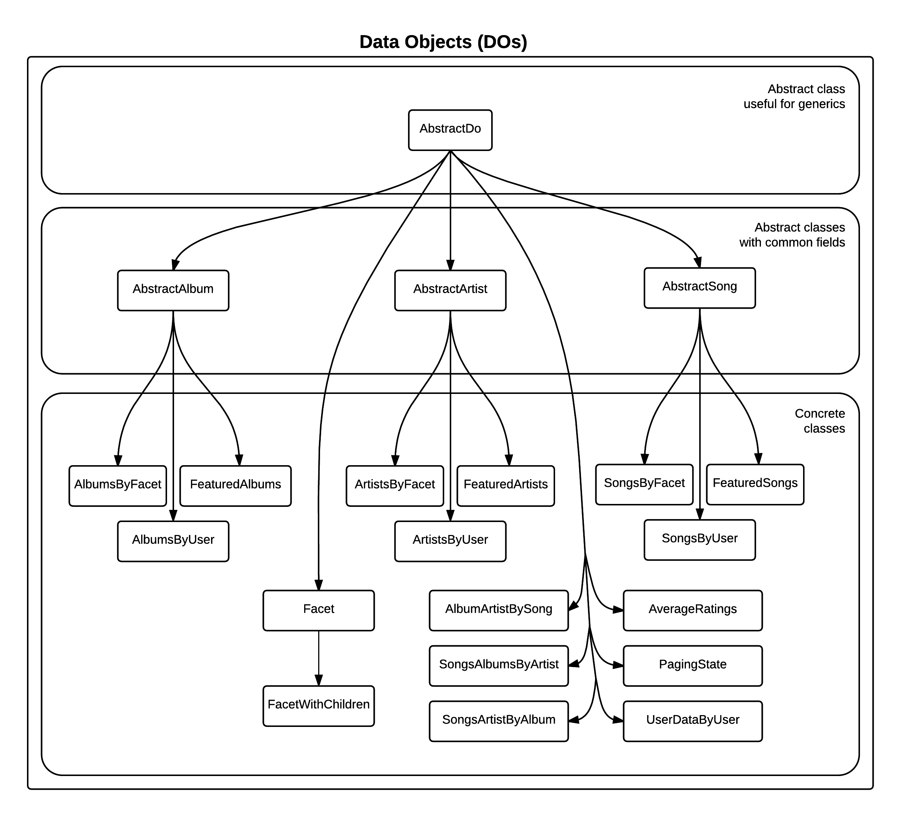

Kenzan Million Song Library Demonstration
=========================================
Bill Schwanitz <bschwanitz@kenzan.com>
:Author Initials: WES
:toc:
:icons:
:numbered:
:website: http://kenzan.com/

Introduction
------------
Some marketing-ish description of what MSL is and why Kenzan is working on it

GitHub Repositories
-------------------
The artifacts for this open source project are available from GitHub (http://github.com/kenzanmedia/million-song-library). This is the master repository for all the available artifacts. This master repo refers to most of its artifacts via multiple sub-repositories (git submodules) - one for each service, configuration, and UI service. Subdividing the repositories this way allows for easy configuration of our continuous integration (CI) jobs, while at the same time the master repository makes for easy retrieval of the entire project.

.Directory and Repository Diagram
image:images/architecture/Directory and Repo Diagram.png[Directory and Repository Diagram]

Tools
-----

API Documentation and Code Generation 
~~~~~~~~~~~~~~~~~~~~~~~~~~~~~~~~~~~~~
The Swagger open-source tool (http://github.com/swagger-api) allows the team to unify the documentation of the API with the generation of client and server code. This assures that the documentation is always in sync with the code. Further, it allows the team to
publish the documentation in various formats. 

Documentation
~~~~~~~~~~~~~
The AsciiDoc open-source tool (http://asciidoc.org/) allows the team to produce documentation that can then be formatted and published in a variety of formats. 

Client
------

Architecture
~~~~~~~~~~~~
[red]#TBA#: a diagram of the client architecture

Language(s) and Frameworks
~~~~~~~~~~~~~~~~~~~~~~~~~~
AngularJS
^^^^^^^^^
This project is a single page app built on the AngularJS framework (https://angularjs.org/). AngularJS is a flexible toolset that works well with other libraries.

Sass
^^^^
The project uses Sass (http://sass-lang.com), a CSS pre-processor, meaning that it extends the CSS language, adding features that allow variables, mixins, functions and many other techniques that allow you to make CSS that is more maintainable, themable and extendable. This project uses the SCSS syntax.

Material Design
^^^^^^^^^^^^^^^
At the root of this CSS and Angular architecture lies Google's Material Design (http://www.getmdl.io/). We are using the Angular Material (https://material.angularjs.org/) version of Material Design to leverage built in Angular components.

KSS Styleguide Generation
^^^^^^^^^^^^^^^^^^^^^^^^^
KSS (http://warpspire.com/kss/styleguides/) is a set of guidelines to help you produce an HTML styleguide tied to CSS documentation that is nice to read in plain text, yet structured enough to be automatically extracted and processed by a machine. It is designed with CSS preprocessors (such as Sass or LESS) in mind, and flexible enough to accommodate a multitude of CSS frameworks (such as YUI, Blueprint or 960).

ES2015
^^^^^^
This project leverages new JavaScript features available in ES2015. Babel (https://babeljs.io/) is used to transpile the JavaScript.

Webpack
^^^^^^^
Webpack (https://webpack.github.io/) is a module bundler. It is used to produce static assets from modules with dependencies.

Server
------

Architecture
~~~~~~~~~~~~
.High-level Architecture Diagram
image:images/architecture/High Level Architecture Diagram.png[High-level Architecture Diagram]

Data Client Layer
^^^^^^^^^^^^^^^^^
As a simplification to a traditional edge/middle architecture, this project uses a edge/data client architecture instead. The data clients are jars, each containing all the methods and DOs for accessing all the tables within a Cassandra cluster. To enhance scalability and configuration flexibility, the Cassandra tables are split into three independent clusters: account, catalog, and rating. Each of these clusters has a data client jar dedicated to accessing it: account-data-client, catalog-data-client, and rating-data-client, respectively.

So a microservice that needs to access Cassandra data will include one or more of the data client jars.

.Data Client and Cassandra Cluster Details

.Account Data Client DOs
[width="100%",cols="2,10",options="header"]
|=======================
|Table                    |DO
<|users                  <|User
<|songs_by_user          <|SongsByUser
<|albums_by_user         <|AlbumsByUser
<|artists_by_user        <|ArtistsByUser
|=======================

.Account Data Client Methods
[width="100%",cols="2,10",options="header"]
|=======================
|Table                       |Method
.3+<|users                  <|Observable<Void> addOrUpdateUser(User)
                            <|Observable<User> getUser(UUID userUuid)
                            <|Observable<Void> deleteUser(UUID userUuid)
.6+<|songs_by_user          <|Observable<Void> addOrUpdateSongsByUser(SongsByUser)
                            <|Observable<SongsByUser> getSongsByUser(UUID userId, Timestamp favoritesTimestamp, UUID songUuid)
                            <|Observable<ResultSet> getSongsByUser(UUID userId, Timestamp favoritesTimestamp, Optional<Integer> limit)
                            <|Observable<ResultSet> getSongsByUser(UUID userId, Optional<Integer> limit)
                            <|Observable<Result<SongsByUser> map(Observable<ResultSet>)
                            <|Observable<Void> deleteSongsByUser(UUID userId, Timestamp favoritesTimestamp, UUID songUuid)
.6+<|albums_by_user         <|Observable<Void> addOrUpdateAlbumsByUser(AlbumsByUser)
                            <|Observable<AlbumsByUser> getAlbumsByUser(UUID userId, Timestamp favoritesTimestamp, UUID albumUuid)
                            <|Observable<ResultSet> getAlbumsByUser(UUID userId, Timestamp favoritesTimestamp, Optional<Integer> limit)
                            <|Observable<ResultSet> getAlbumsByUser(UUID userId, Optional<Integer> limit)
                            <|Observable<Result<AlbumsByUser> map(Observable<ResultSet>)
                            <|Observable<Void> deleteAlbumsByUser(UUID userId, Timestamp favoritesTimestamp, UUID albumUuid)
.6+<|artists_by_user        <|Observable<Void> addOrUpdateArtistsByUser(ArtistsByUser)
                            <|Observable<ArtistsByUser> getArtistsByUser(UUID userId, Timestamp favoritesTimestamp, UUID artistUuid)
                            <|Observable<ResultSet> getArtistsByUser(UUID userId, Timestamp favoritesTimestamp, Optional<Integer> limit)
                            <|Observable<ResultSet> getArtistsByUser(UUID userId, Optional<Integer> limit)
                            <|Observable<Result<ArtistsByUser> map(Observable<ResultSet>)
                            <|Observable<Void> deleteArtistsByUser(UUID userId, Timestamp favoritesTimestamp, UUID artistUuid)
|=======================

.Catalog Data Client DOs
[width="100%",cols="2,10",options="header"]
|=======================
|Table                    |DO
<|featured_songs         <|FeaturedSongs
<|songs_by_facet         <|SongsByFacet
<|featured_albums        <|FeaturedAlbums
<|albums_by_facet        <|AlbumsByFacet
<|featured_artists       <|FeaturedArtists
<|artists_by_facet       <|ArtistsByFacet
<|songs_albums_by_artist <|SongsAlbumsByArtist
<|songs_artist_by_album  <|SongsArtistByAlbum
<|album_artist_by_song   <|AlbumArtistBySong
<|paging_state           <|PagingState
|=======================

.Catalog Data Client Methods
[width="100%",cols="2,10",options="header"]
|=======================
|Table                       |Method
.2+<|featured_songs         <|Observable<ResultSet> getFeaturedSongs(Optional<Integer> limit)
                            <|Observable<Result<FeaturedSongs> map(Observable<ResultSet>)
.2+<|songs_by_facet         <|Observable<ResultSet> getSongsByFacet(String facetName, Optional<Integer> limit)
                            <|Observable<Result<SongsByFacet> map(Observable<ResultSet>)
.2+<|featured_albums        <|Observable<ResultSet> getFeaturedAlbums(Optional<Integer> limit)
                            <|Observable<Result<FeaturedAlbums> map(Observable<ResultSet>)
.2+<|albums_by_facet        <|Observable<ResultSet> getAlbumsByFacet(String facetName, Optional<Integer> limit)
                            <|Observable<Result<AlbumsByFacet> map(Observable<ResultSet>)
.2+<|featured_artists       <|Observable<ResultSet> getFeaturedArtists(Optional<Integer> limit)
                            <|Observable<Result<FeaturedArtists> map(Observable<ResultSet>)
.2+<|artists_by_facet       <|Observable<ResultSet> getArtistsByFacet(String facetName, Optional<Integer> limit)
                            <|Observable<Result<ArtistsByFacet> map(Observable<ResultSet>)
.2+<|songs_albums_by_artist <|Observable<ResultSet> getSongsAlbumsByArtist(UUID artistUuid, Optional<Integer> limit)
                            <|Observable<Result<SongsAlbumsByArtist> map(Observable<ResultSet>)
.2+<|songs_artist_by_album  <|Observable<ResultSet> getSongsArtistByAlbum(UUID albumUuid, Optional<Integer> limit)
                            <|Observable<Result<SongsArtistByAlbum> map(Observable<ResultSet>)
.2+<|album_artist_by_song   <|Observable<ResultSet> getAlbumArtistBySong(UUID songUuid, Optional<Integer> limit)
                            <|Observable<Result<AlbumArtistBySong> map(Observable<ResultSet>)
.3+<|paging_state           <|Observable<Void> addOrUpdatePagingState(PagingState)
                            <|Observable<PagingState> getPagingState(UUID pagingStateUuid)
                            <|Observable<Void> deletePagingState(UUID pagingStateUuid)
|=======================

.Rating Data Client DOs
[width="100%",cols="2,10",options="header"]
|=======================
|Table                    |DO
<|average_ratings        <|AverageRating
<|user_ratings           <|UserRatings
|=======================

.Rating Data Client Details
[width="100%",cols="2,10",options="header"]
|=======================
|Table                       |Method
.3+<|average_ratings        <|Observable<Void> addOrUpdateAverageRating(AverageRating)
                            <|Observable<AverageRating> getAverageRating(UUID contentId, String contentType)
                            <|Observable<Void> deleteAverageRating(UUID contentId, String contentType)
.6+<|user_ratings           <|Observable<Void> addOrUpdateUserRatings(UserRatings)
                            <|Observable<UserRatings> getUserRatings(UUID userUuid, String contentType, UUID contentUuid)
                            <|Observable<ResultSet> getUserRatings(UUID userUuid, String contentType, Optional<Integer> limit)
                            <|Observable<ResultSet> getUserRatings(UUID userUuid, Optional<Integer> limit)
                            <|Observable<Result<UserRatings> map(Observable<ResultSet>)
                            <|Observable<Void> deleteUserRatings(UUID userUuid, String contentType, UUID contentUuid)
|=======================

APIs
^^^^
[red]#TBA#: links to Swagger generated API doc(s)

Data POJOs
^^^^^^^^^^
The server has three different classifications of data POJOs:

. Models: classes that represent the data payloads that are passed back and forth between clients and server
. Data Objects (DOs): classes that represent the data persisted in Cassandra
. Business Objects (BOs): classes that aid converting between models and DOs

.High Level Data POJOs Diagram

Models
++++++
The model classes are generated by Swagger and represent all the data payloads that are passed between client and server.

.Model Classes Architecture Diagram

Data Objects (DOs)
++++++++++++++++++
Data Objects represent the data as it is persisted in Cassadra. In fact, there is a one-to-one correspondence between Cassandra tables and concrete DO classes. Often this data is optimized for Cassandra, so needs to undergo some massaging to convert it to a model.

.Data Object Classes Architecture Diagram

Business Objects (BOs)
++++++++++++++++++++++
Business object classes are the glue inside the server between model classes and DO classes. In many cases there is not a simple one-to-one connection between reading a DO from Cassandra and sending that as a model to the client. For example: when building an AlbumInfo model, the album's metadata, community and user ratings must be merged. The BO contains the merged representation of the data.

.Business Object Classes Architecture Diagram
image:images/architecture/dataobjects/Business Objects.png[Business Object Classes Architecture Diagram]

Language(s) and Frameworks
~~~~~~~~~~~~~~~~~~~~~~~~~~
The back-end server is written in Java - Enterprise Edition 1.8, to be exact. Communication between client and server is performed using a RESTful web service over HTTP. The REST code stubs, generated by Swagger (http://github.com/swagger-api), use JaxRs annotations (http://jax-rs-spec.java.net). Java's Jersey library (http://jersey.java.net) is used as the implementation of the JaxRs API. JUnit is used as out unit testing framework.

Portions of the Netflix OSS stack are used to provide cloud services. At its foundation, the server is based on Karyon (http://github.com/Netflix/karyon) - this enables the use of other useful Netflix OSS tools. For example, Archaius (http://github.com/Netflix/archaius) is used as the configuration manager allowing the service to react to changes in configuration parameters dynamically.

All data is persisted using Apache's Cassandra (http://cassandra.apache.org). Cassandra is a highly available, scalable NoSQL database. The DataStax Java driver and row->POJO mapper (http://datastax.github.io/java-driver) are used to interface the Java code with the Cassandra database.

That is a *LOT* of information. Let's summarize...

.Server Languages and Frameworks
[width="60%",cols="6,^3,^3,1",options="header"]
|=======================
|Use 						|Name 			|Vendor 		|Link
|Language 					|Java EE 1.8 	|Oracle 		|link:http://www.java.com[html]
|API Documentor/Generator 	|Swagger 		|open-souce 	|link:http://github.com/swagger-api[html]
|ReST API 					|JaxRs 			|Oracle 		|link:http://jax-rs-spec.java.net[html]
|ReST Implementation 		|Jersey 		|Oracle 		|link:http://jersey.java.net[html]
|Unit Testing 				|JUnit 			|JUnit 			|link:http://junit.org[html]
|Cloud Infrastructure 		|Karyon 		|Netflix OSS 	|link:http://github.com/Netflix/karyon[html]
|Configuration Management 	|Archaius 		|Netflix OSS 	|link:http://github.com/Netflix/archaius[html]
|Database 					|Cassandra 		|Apache 		|link:http://cassandra.apache.org[html]
|Database Driver 			|DataStax 		|DataStax 		|link:http://datastax.github.io/java-driver[html]
|Database Row->POJO Mapper 	|Datastax 		|DataStax 		|link:http://datastax.github.io/java-driver[html]
|Reactive Code Library 		|RxJava 		|Netflix 		|link:http://techblog.netflix.com/2013/02/rxjava-netflix-api.html[html]
|=======================

Album Cover Artwork
~~~~~~~~~~~~~~~~~~~
Album cover artwork is being retrieved from MusicBrainz (http://musicbrainz.org), "an open music encyclopedia that collects music metadata and makes it available to the public," and Cover Art Archive (http://converartarchive.org), "whose goal is to make cover art images available to everyone on the Internet in an organised and convenient way." The Million Song Library data contains an artist's MusicBrainz ID (artist_mbid). As part of the data import process, this identifier is used via the MusicBrainz and Cover Art Archive APIs to retrieve the links to artwork. All interactions with MusicBrains and the Cover Art Archive will be performed during the data import process - no queries to either of these sites will occur when the Kenzan MSL server is running.

MusicBrainz Access
^^^^^^^^^^^^^^^^^^
We use the musicbrainzws2-java Java library (https://github.com/schnatterer/musicbrainzws2-java) to access the MusicBrainz API.

Code Snippet
++++++++++++
[source,java]
Controller controller = new Controller();
Artist artist = new Artist();
artist.setId(<MusicBrainz artist mbid>);
artist = controller.lookUp(artist);

Parsing and Using MusicBrainz Data
^^^^^^^^^^^^^^^^^^^^^^^^^^^^^^^^^^

Multiple "releases" (AKA albums) can be returned for the requested artist. The data import code will review the available releases/albums for the artist and select album art using the following algorithm:

. Consider only those releases/albums whose title matches (case-INsensitively) the name of the album from the MSL data
. Consider only those release/albums with cover-art-archive/front = true
. Give preference to possibly multiple candidates based on packaging in this order:
.. "Jewel Case" (this is a CD)
.. "Cardboard/Paper Sleeve" (this is an LP)
.. "Cassette Case" (this is a cassette, obviously)
.. anything else

If a particular piece of art is NOT available, the image link field in the database will be left blank/null. If artwork is available, then the data import process will retrieve the image URL from the Cover Art Archive (http://coverartarchive.org) REST API (using CoverArtArchiveClient) and write it into the database.

Cover Art Archive Access
^^^^^^^^^^^^^^^^^^^^^^^^
The CoverArtArchiveClient class from http://github.com/lastfm/coverartarchive-api will be used to retrieve the image URL using the release MBID.

Code Snippet
++++++++++++
[source,java]
CoverArtArchiveClient client = new DefaultCoverArtArchiveClient();
UUID releaseMbid = UUID.fromString(<MusicBrainz release mbid>);
CoverArt coverArt = client.getByMbid(releaseMbid);
if (coverArt != null) {
    for (CoverArtImage coverArtImage : coverArt.getImages()) {
        if(coverArtImage.isFront()) {
            String imageUrl = coverArtImage.getSmallThumbnail()
            if (null == imageUrl) {
                coverArtImage.getLargeThumbnailUrl()); 
            }
            if (null == imageUrl) {
                coverArtImage.getImageUrl()); 
            }
        }
    }
}

Parsing and Using CoverArtArchive Data
^^^^^^^^^^^^^^^^^^^^^^^^^^^^^^^^^^^^^^

As can be seen in the code snippet, above, multiple images can be returned for the requested release/album. The data import code will review the available images for the release/album and select the image URL using the following algorithm:

. Consider only those images where isFront() == true
. Give preference to possibly multiple URLs in this order:
.. small thumbnail
.. large thumbnail
.. image (this is the high resolution image)

If, based on this algorithm, a particular piece of art is NOT available, the image link field in the database will be left blank/null.

"Image Unavailable" Images
^^^^^^^^^^^^^^^^^^^^^^^^^^

When preparing to send a link to artwork in response to a request to our server, if the image link URL from the database is blank/null, the server will insert a URL, defined as a configuration parameter, that points to an "artwork unavailable" image on the pages server. Three "artwork unavailable" images (one each for: album, artist, and song) will exist for http retrieval from the pages server.

Database
~~~~~~~~
There is so much detail to include here, it deserves link:Database.adoc [its own page].
