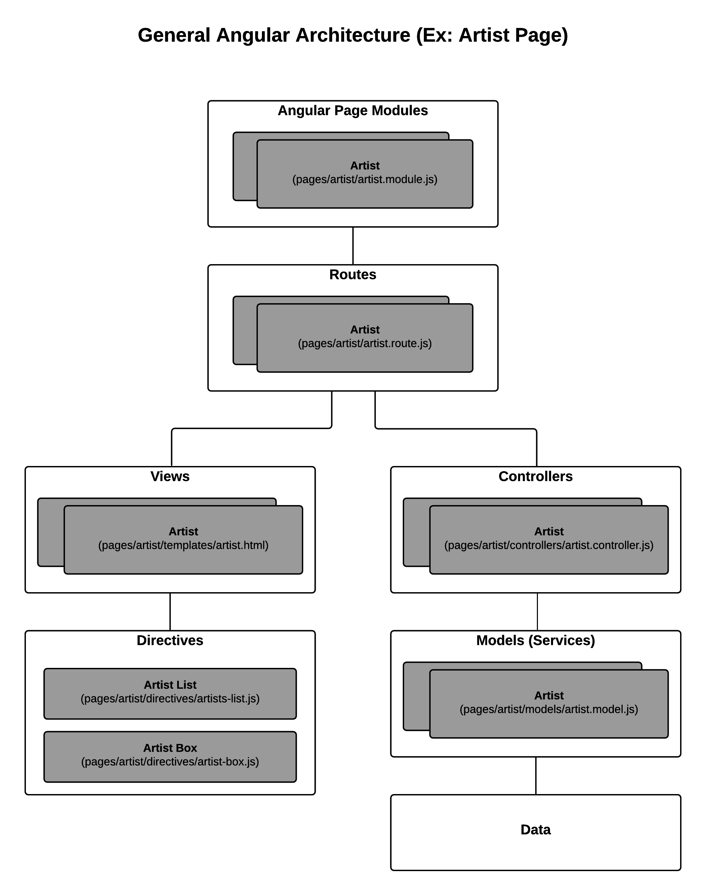

= Client/UI Architecture
:sectnums:
:icons: font

The Million Song Library client architecture is modular by design and takes advantage of modern Web application languages and frameworks.

== AngularJS

The Million Song Library UI presents itself to the user as a single-page app built using https://angularjs.org/[AngularJS^]. AngularJS is an open-source JavaScript framework that extends HTML and enables the creation of dynamic Web applications. It provides a flexible toolset that works well with other libraries.

ifeval::["{output}"=="html"]
.UI High-level Architecture

endif::[]

ifeval::["{output}"=="pdf"]
.UI High-level Architecture

endif::[]

== Sass

We use http://sass-lang.com[Sass^] (along with SCSS syntax) to help manage the complex CSS stylesheets that make the Million Song Library UI possible. Sass is a CSS pre-processor that extends the CSS language. It adds features that allow the use of variables, mixins, functions, and other techniques that make CSS much more maintainable, themable, and extendable.

== Material Design

Underlying the CSS and Angular architecture of the Million Song Library UI is http://www.getmdl.io/[Google's Material Design^], which provides an accessible look and feel that scales across browsers and devices. We use the https://material.angularjs.org/[Angular Material^] version of Material Design to leverage its built-in AngularJS components. Adopting Material Design allows for extensibility of the Million Song Library UI and makes it easy for others to add their own features.

== KSS Styleguide Generation

http://warpspire.com/kss/styleguides/[KSS^] provides a specification and styleguide format that helps you produce CSS documentation as well as example HTML that shows your styles in action. The KSS documentation syntax is readable by humans, yet is structured enough to be automatically parsed by a machine. It's designed with CSS preprocessors (such as Sass or Less) in mind, and is flexible enough to accommodate a multitude of CSS frameworks (such as YUI, Blueprint, or 960).

== ES2015

The Million Song Library UI uses new features (like `await` and `async`) available in the latest version of the JavaScript programming language, ES2015. We use https://babeljs.io/[Babel^] to transpile ES2015 script into standard JavaScript syntax that today's browsers can understand.

== Webpack

https://webpack.github.io/[Webpack^] is a module bundler. We use it to produce static assets from modules that have dependencies. The main `index.html` file is built using the https://github.com/ampedandwired/html-webpack-plugin[HTML Webpack Plugin^].
