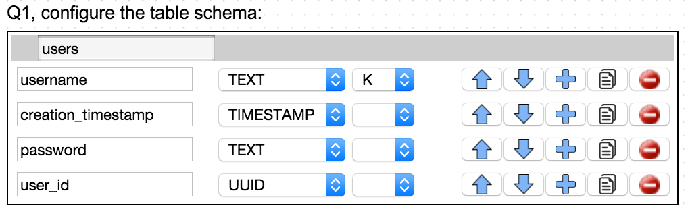
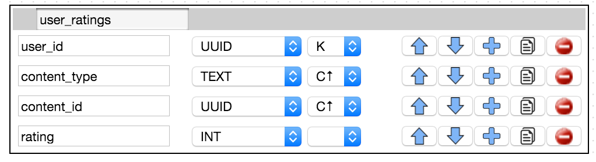
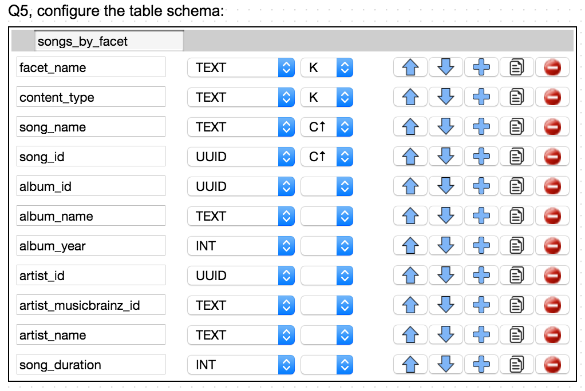
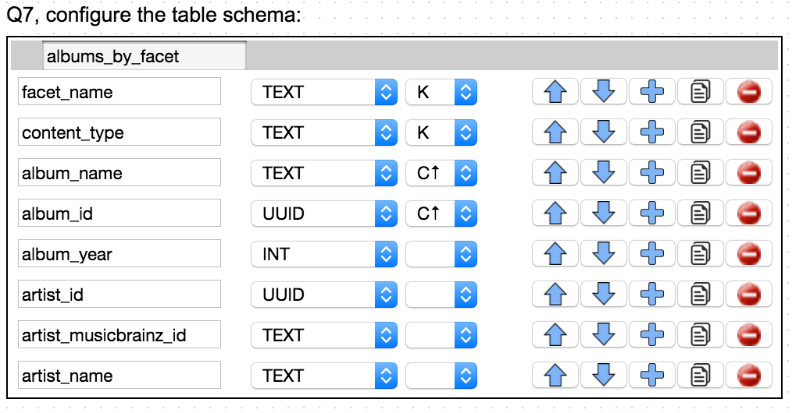
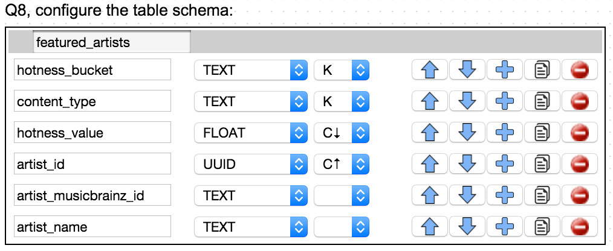
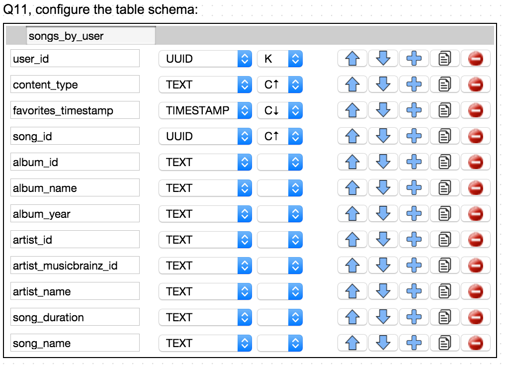
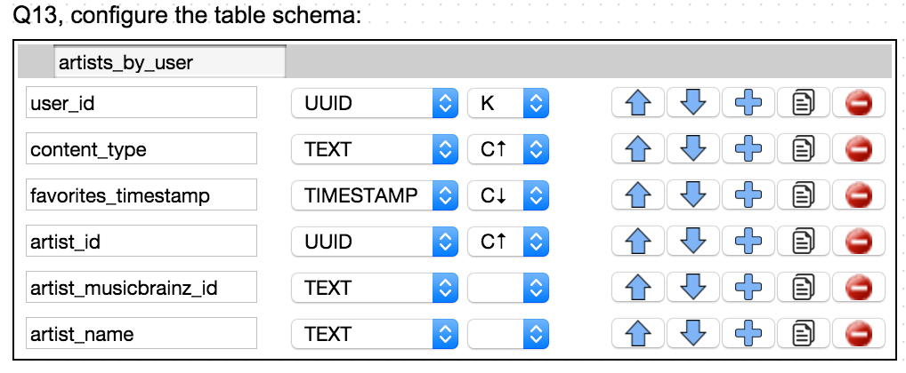
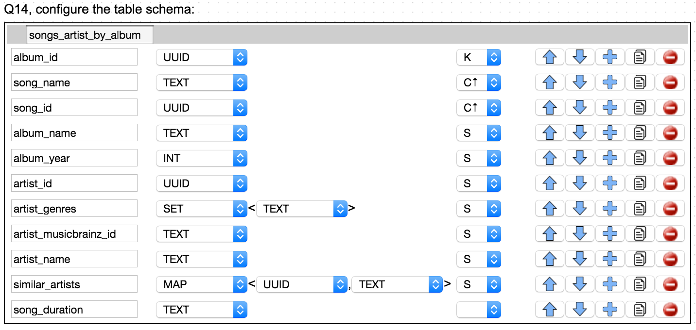

= Database Architecture
:sectnums:
:icons: font
:blank: pass:[ +]

Due to the large amount of data to be persisted, and the need for quick reads and linear scalable performance, the Million Song Library project uses Cassandra as the back-end datastore, along with the Datastax Java driver as the interface.

== Design

We used the http://kdm.dataview.org[Kashlev Data Modeler^] (KDM) to model the Cassandra schema. 

=== Entity-Relationship Model

Initially, we performed a traditional data analysis -- looking at what entities are required based on the use cases, and what the relationships are between those entities. The result is illustrated in the https://en.wikipedia.org/wiki/Entity%E2%80%93relationship_model[entity-relationship model^] below which was created with KDM and uses Chen's notation.

ifeval::["{output}"=="html"]
.Entity Relationship Model
image:images/database/entity_relationship.png[Entity Relationship Diagram]
endif::[]

ifeval::["{output}"=="pdf"]
.Entity Relationship Model
image:images/database/entity_relationship.png[Entity Relationship Diagram, width=600]
endif::[]

=== Access Patterns

Next, we used those same use cases to determine how the data in the entities would be accessed. Given the use patterns of a Cassandra datastore, it's important to think in terms of queries when designing the schema. This can be a challenging transition for those accustomed to building SQL schemas. Maybe even more challenging is the need to denormalize the schema -- a thought that could keep an SQL database designer up at night. Luckily, there are many good tutorials and documents online dicussing this process.

ifeval::["{output}"=="html"]
.Access Patterns Diagram
image:images/database/access_patterns.png[Access Patterns Diagram]
endif::[]

ifeval::["{output}"=="pdf"]
.Access Patterns Diagram
image:images/database/access_patterns.png[Access Patterns Diagram, width=500]
endif::[]

== Implementation

The following table shows the details for each query included in the access patterns diagram above.

NOTE: Fields marked with *K* are partition keys. Fields marked with *C* are cluster keys.

ifeval::["{output}"=="html"]
.Queries 
[width="100%",cols="2,4,12",options="header"]
|===
|Query Number	|Description			|Table Schema
|Q1				|Users					|
|Q2				|User ratings		    |
|Q3				|Average Ratings		|image:images/database/Q03 average ratings.png[Average Ratings]
|Q4				|Featured Songs			|image:images/database/Q04 featured songs.png[Featured Songs]
|Q5				|Songs by Facet			|
|Q6				|Featured Songs			|image:images/database/Q06 featured songs.png[Featured Songs]
|Q7				|Songs by Facet			|
|Q8				|Featured Artists		|
|Q9				|Artists by Facet		|image:images/database/Q09 artists by facet.png[Artists by Facet]
|Q10			|Songs/Albums by Artist	|image:images/database/Q10 songs albums by artist.png[Songs/Albums by Artist]
|Q11			|Songs by User			|
|Q12			|Albums by User			|image:images/database/Q12 albums by user.png[Albums by User]
|Q13			|Artists by User		|
|Q14			|Songs/Artist by Album	|
|Q15			|Album/Artist by Song	|image:images/database/Q15 album artist by song.png[Album/Artist by Song]
|Q16			|Paging State			|image:images/database/Q16 paging state.png[Paging State]
|===
endif::[]

ifeval::["{output}"=="pdf"]
.Queries 
[width="100%",cols="2,4,12",options="header"]
|===
|Query Number	|Description			|Table Schema
|Q1				
|Users
{blank} 
{blank}
{blank}
{blank}
{blank}
{blank}
{blank}
|
|Q2				|User ratings
{blank} 
{blank}
{blank}
{blank}
{blank}
{blank}
{blank}
|
|Q3				|Average Ratings
{blank} 
{blank}
{blank}
{blank}
{blank}
{blank}
{blank}
|image:images/database/Q03 average ratings.png[Average Ratings, width=400]
|Q4				|Featured Songs
{blank} 
{blank}
{blank}
{blank}
{blank}
{blank}
{blank}
{blank} 
{blank}
{blank}
{blank}
{blank}
{blank}
{blank}
{blank} 
{blank}
|image:images/database/Q04 featured songs.png[Featured Songs, width=400]
|Q5				|Songs by Facet
{blank} 
{blank}
{blank}
{blank}
{blank}
{blank}
{blank}
{blank} 
{blank}
{blank}
{blank}
{blank}
{blank}
{blank}
{blank}
|
|Q6				|Featured Songs
{blank} 
{blank}
{blank}
{blank}
{blank}
{blank}
{blank}
{blank} 
{blank}
{blank}
{blank}
{blank}
{blank}
|image:images/database/Q06 featured songs.png[Featured Songs, width=400]
|Q7				|Songs by Facet
{blank} 
{blank}
{blank}
{blank}
{blank}
{blank}
{blank}
{blank} 
{blank}
{blank}
{blank}
{blank}
{blank}
{blank}
|
|Q8				|Featured Artists
{blank} 
{blank}
{blank}
{blank}
{blank}
{blank}
{blank}
{blank} 
{blank}
{blank}
{blank}
{blank}
{blank}
{blank}
|
|Q9				|Artists by Facet
{blank} 
{blank}
{blank}
{blank}
{blank}
{blank}
{blank}
{blank} 
{blank}
{blank}
{blank}
{blank}
{blank}
{blank}
|image:images/database/Q09 artists by facet.png[Artists by Facet, width=400]
|Q10			|Songs/Albums by Artist
{blank} 
{blank}
{blank}
{blank}
{blank}
{blank}
{blank}
{blank} 
{blank}
{blank}
{blank}
{blank}
{blank}
{blank}
|image:images/database/Q10 songs albums by artist.png[Songs/Albums by Artist, width=400]
|Q11			|Songs by User
{blank} 
{blank}
{blank}
{blank}
{blank}
{blank}
{blank}
{blank} 
{blank}
{blank}
{blank}
{blank}
{blank}
{blank}
{blank} 
{blank}
{blank}
{blank}
{blank}
{blank}
{blank}
|
|Q12			|Albums by User	
{blank} 
{blank}
{blank}
{blank}
{blank}
{blank}
{blank}
{blank} 
{blank}
{blank}
{blank}
{blank}
{blank}
{blank}
|image:images/database/Q12 albums by user.png[Albums by User, width=400]
|Q13			|Artists by User
{blank} 
{blank}
{blank}
{blank}
{blank}
{blank}
{blank}
{blank} 
{blank}
{blank}
{blank}
{blank}
{blank}
{blank}
|
|Q14			|Songs/Artist by Album
{blank} 
{blank}
{blank}
{blank}
{blank}
{blank}
{blank}
{blank} 
{blank}
{blank}
{blank}
{blank}
{blank}
{blank}
|
|Q15			|Album/Artist by Song
{blank} 
{blank}
{blank}
{blank}
{blank}
{blank}
{blank}
{blank} 
{blank}
{blank}
{blank}
{blank}
{blank}
{blank}
|image:images/database/Q15 album artist by song.png[Album/Artist by Song, width=400]
|Q16			|Paging State
{blank} 
{blank}
{blank}
{blank}
{blank}
{blank}
{blank}
|image:images/database/Q16 paging state.png[Paging State, width=400]
|===
endif::[]

== Data Import

The Million Song Library project uses data from the http://labrosa.ee.columbia.edu/millionsong/pages/getting-dataset[Million Song Dataset^]. (A 10,000 song subset of the full data set is also available.) Downloading the data set yields a gzipped file that contains two directories: *AdditionalFiles* and *data*. The *data* directory has a number of subdirectories that contain an *HDF* file (with the extension *h5*) for each song in the data set. The *AdditionalFiles* directory contains several files that summarize the data set -- these files are not used for the import.

HDF or https://en.wikipedia.org/wiki/Hierarchical_Data_Format[Hierarchical Data Format^] files contain all the data needed for albums, artists, and songs. We use the Python library written by mailto:tb2332@columbia.edu[Thierry Bertin-Mahieux] to read these files. (We initially tried using Java and https://www.hdfgroup.org/products/java/JNI/jhi5/[JHI5^] but ran into issues with the native library aspect of that implementation.)

At a high level, the data import process uses Python to traverse a given directory tree, consuming all of the *.h5* files and creating a single CSV file with one line for each song. This CSV file is then consumed by a Java program to create the CSVs that are inserted into the Cassandra cluster.

NOTE: The tags within an *.h5* file (*/metadata/artist_terms*) essentially indicate the genre of the song. There are so many genres used in the data set that it makes them not particularly useful as a searching mechanism. For this reason, a list of genres is defined in *Genre.java* to declare which of the genres we are interested in persisting. Any genres not found in the list are ignored.