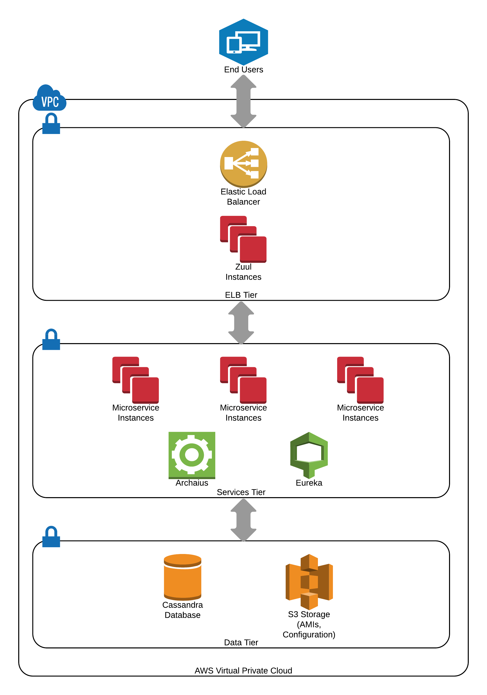

= Million Song Library Overview
:sectnums:
:icons: font

At Kenzan, we build Platform as a Service (PaaS) solutions that enable our customers to deliver secure, database-driven applications anywhere they want, anytime they need. We're a big believer in the open source software (OSS) tools created by Netflix, along with other cool things like microservices, NoSQL databases, and scalable cloud infrastructure. These technologies, and more, help power us through all phases of delivering a customized PaaS solution, from architecture and application development to testing and DevOps.

So why did we start the Million Song Library (MSL) project? There are a couple of reasons. First, we wanted to build a model to demonstrate the capability and flexibility offered by some of the Netflix OSS components when paired with a Cassandra database. Second, we thought it would be pretty neat to have a ready-to-go foundation on top of which database-driven applications can be rapidly developed, tested, and deployed to the cloud.

And here's the best part -- we're taking the whole thing open source. Because at Kenzan, we want everyone to have the power to build a dynamic library with a million songs. Or a million funny videos. Or a million must-have gadgets. Or a million loyal customers. Or whatever it is that you're a big beliver in.

TIP: Need a companion on your journey to the cloud? We're always up for an adventure -- just knock on our door at http://www.kenzan.com[Kenzan.com^].

== Key Technologies

The diagram below shows some of the key techologies we use in creating a database-driven, microservices-based Web application like the Million Song Library project. Read on for information about each of the technologies.

ifeval::["{output}"=="html"]
.Million Song Library Key Technologies

endif::[]

ifeval::["{output}"=="pdf"]
.Million Song Library Key Technologies

endif::[]

[[microservices-architecture]]
== Microservices Architecture

In a microservices architecture, large applications are made up of multiple smaller services that can be independently deployed using automated methods. Each microservice is self-contained and provides a targeted piece of functionality. Microservices are discoverable, so clients and servers can automatically find one another. And they communicate using standard, lightweight protocols such as REST APIs.

At Kenzan, we have a lot of experience working with microservices. We've found that adopting a microservices architecture results in Web applications that are more modular and easier to manage compared to traditional, monolithic applications. Because microservices can be scaled independently, distributing them across servers, you have the flexibility to quickly meet changing demands. Usage of one microservice is going way up? Just add more instances of it. Need to add another cabability to your application? It's as simple as updating a microservice or creating a new one. You don't have to rebuild and deploy the entire application just to push out a change.

While microservices bring a lot of advantages, building a microservices-based solution from the ground up could present a challenge. That's why the Million Song Library leverages a number of https://netflix.github.io/[open source software (OSS) libraries from Netflix^]. The Netflix OSS components provide support for building applications using a suite of microservices, greatly easing the transition to a microservices-based architecture. What's more, they've been tried and tested in one of the most demanding cloud environments imaginable.

Here are some of the Netflix OSS tools that make the Million Song Library possible.

https://github.com/Netflix/karyon[Karyon^]:: _Cloud infrastructure blueprint._ Constructing a complex architecture requires a solid foundation. Karyon provides a scaffold for building cloud-based services, and it offers hooks for other Netflix OSS tools. When an application is based on the Karyon blueprint, it gains the ability to leverage a common core of functionality. A Karyon application can initialize itself and its dependencies, make itself available for discovery, and even let the rest of the platform know whether it's healthy or not.

https://github.com/Netflix/zuul[Zuul^]:: _Intelligent request routing._ You might remember Zuul as https://en.wikipedia.org/wiki/Ghostbusters[the gatekeeper from the movie Ghostbusters^]. In a microservices architecture, Zuul watches the front gate of your application and ensures that only the correct actors can access the correct services. Zuul uses pre-defined filters to allow or reject calls made to the application, and it dynamically routes requests to different application instances in response to changing demand. Zuul can even track statistics and perform stress testing to help make sure the system is prepared for times when usage spikes.

https://github.com/Netflix/eureka[Eureka^]:: _Private load balancing._ Using cloud-based load balancers in a microservices architecture can quickly become cumbersome. This is due to the vast number of microservices and possible routes between them -- each of which could potentially need its own load balancer. What's more, while cloud-based load balancers are great for distributing loads for edge services that offer public access, they can't help with middle-tier services that reside within a virtual private cloud (VPC) -- services that you don't want the outside world to acccess.
+
That's where Eureka comes in. Eureka is a service registry that manages all active services and ensures that loads are properly distributed. Each time an instance of a microservice starts up, it lets Eureka know that it's available. And if it ever stops sending out a heartbeat, Eureka quickly drops it from the list of available instances. Working in conjunction with Zuul, Eureka helps clients find active servers and gives them the information they need to communicate with one another, all within the VPC. And because server information is cached on the client, the system keeps working even if Eureka becomes unavailable.

https://github.com/Netflix/archaius[Archaius^]:: _Contextual properties management._ Managing configuration properties for a large number of microservices could be problematic. Archaius solves this by storing properties in a central library where they can be easily maintained. At runtime, Archaius checks the software version and environmental values for the application -- that is, the context it's running in. Archaius determines the properties needed for that particular context, and then delivers the appropriate properties to the application over the network.

== High-Performance Database

Today's modern Web is all about data -- storing it, finding it, retrieving it. And all while users are impatiently tapping their screens. As data sets grow larger, having a reliable and  blazingly-fast database is critical for delivering a sucessful database-driven application. That's why, for the Million Song Library, we went with a Cassandra database, along with a DataStax Java driver that provides an interface between the database and the application code.

Cassandra is a NoSQL database that offers much lower latency and higher scalablility than relational databases. Compared to a traditional SQL database, Cassandra can accept data at higher rates and volumes. Cassandra's node-based architecture makes it more resilient because there is no single point of failure. And it's easy to scale out a Cassandra database by adding more nodes (with no need to take the system down first).

Achieving such a high level of performance does require a different way of thinking. In a Cassandra database, transactions need to be simple and can't be nested. And data may be written in multiple locations rather than normalized to a single table. But predictable application performance and constant uptime are well worth the change.

== Cloud-Based Infrastructure

At Kenzan, we build a lot of PaaS solutions on Amazon Web Services (AWS). AWS provides the infrastructure and core services needed to deploy a complex, database-driven application in the cloud:

* https://aws.amazon.com/ec2/[_Elastic Compute Cloud (EC2)_^] lets you create or decommision virtual server instances at will, so you always have just the amount of computing power you need.
* https://aws.amazon.com/autoscaling/[_Auto-Scaling Groups (ASGs)_^] can fire up instances automatically in response to increased load or other conditions.
* http://docs.aws.amazon.com/AWSEC2/latest/UserGuide/AMIs.html[_Amazon Machine Images (AMIs)_^] enable a templated pipeline for successful and repeatable deployment of instances.
* https://aws.amazon.com/elasticloadbalancing/[_Elastic Load Balancing (ELB)_^] distributes traffic from the public web among the available instances so that one doesn't get overwhelmed while others sit idle.
* https://aws.amazon.com/s3/[_Simple Storage Service (S3)_^] provides persistant storage for AMIs, configurations, or image assets.

AWS is hosted on multiple, independent regions and availability zones that provide resiliency -- even if an AWS region goes down, the application is still available. And because the middle-tier and data store reside within the Virtual Private Cloud, the entire platform is secure and protected.

NOTE: The Million Song Library architecture isn't limited to running on AWS. It can be deployed locally. Or feel free to deploy your application to another cloud infrastructure, such as Microsoft Azure or Google Cloud Platform -- whatever makes the most sense for you.

== About the MSL Demo

To take a  deeper dive into the architechure of the Million Song Library project and discover more about the technologies used to build it, just keep reading -- more awaits below.

When you're ready to try out the Million Song Library demo on a Mac, Linux, or Windows computer, just follow the setup instructions, and you'll have your own microservices-based Web application up and running in about an hour:

* <<Setup-Mac.adoc#setup-mac>>
* <<Setup-Ubuntu.adoc#setup-ubuntu>>
* <<Setup-Windows.adoc#setup-windows>>
* <<Setup-Manual.adoc#setup-manual>>

TIP: If you have an AWS account, you can can also deploy the Million Song Library to an EC2 instance. See <<Setup-AWS.adoc#setup-aws>> for step-by-step instructions.

