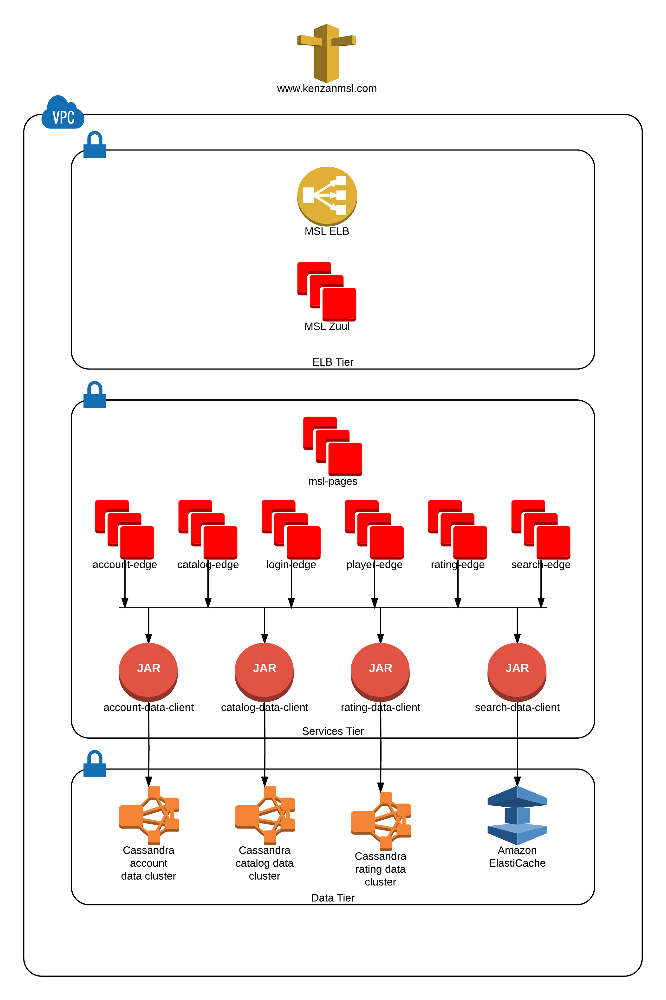
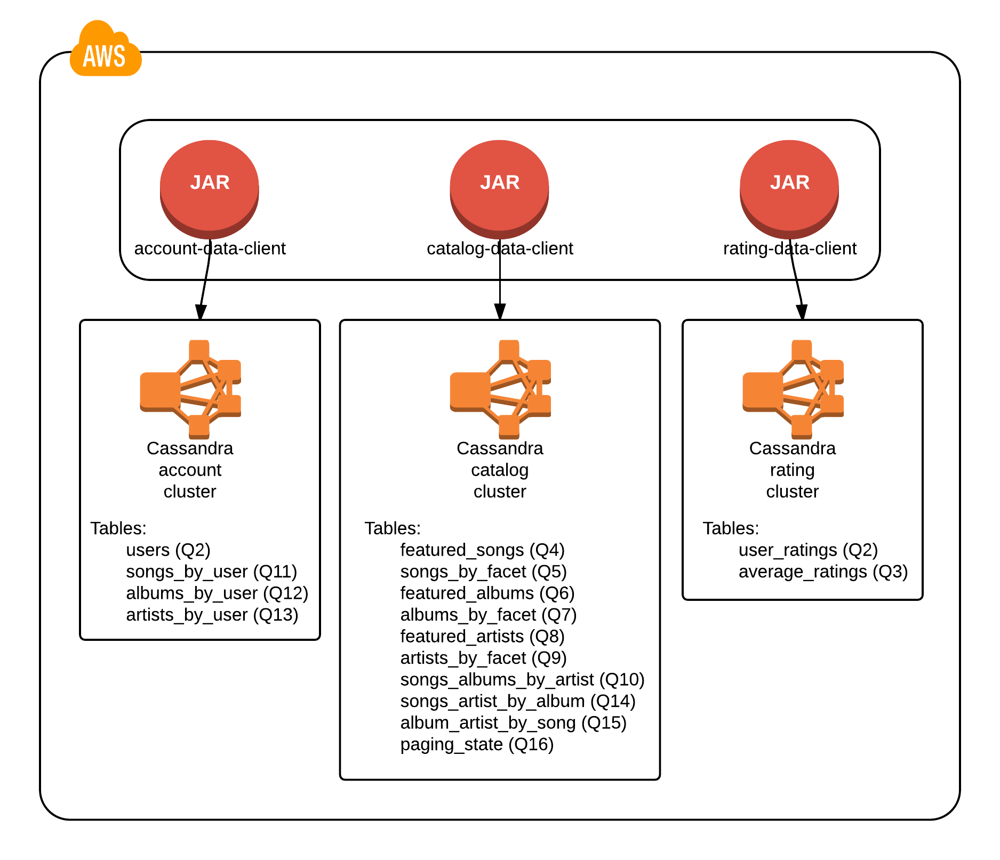
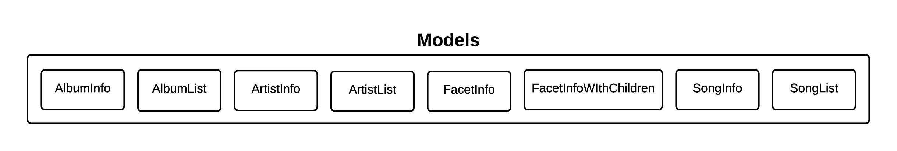
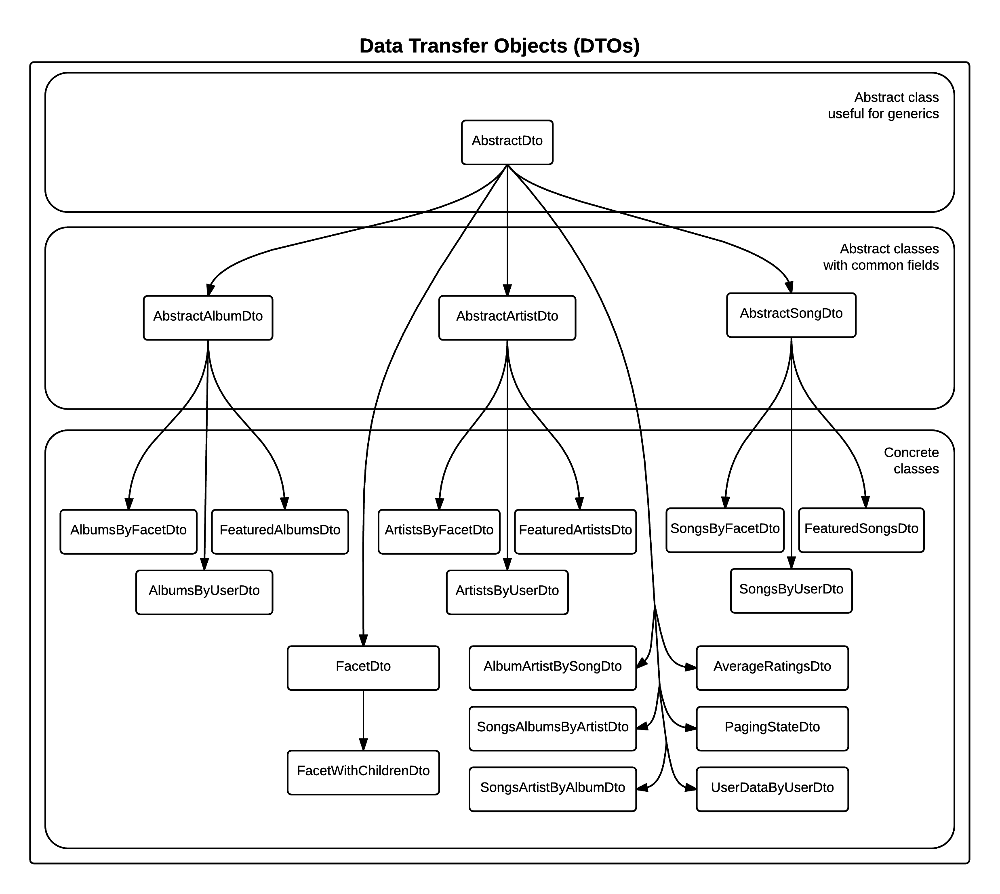

= Server Architecture
:sectnums:
:icons: font

Instead of a traditional edge/middle architecture, the Million Song Library project uses a simplified edge/data client architecture.

ifeval::["{output}"=="html"]
.High-level Server Architecture

endif::[]

ifeval::["{output}"=="pdf"]
.High-level Server Architecture

endif::[]

== Data Client Layer

The data clients are JARs, each one containing the methods and data transfer objects (DTOs) needed to access all of the tables in a Cassandra cluster.

To enhance scalability and configuration flexibility, the Cassandra tables are split into three independent clusters: *account*, *catalog*, and *rating*. Each of these clusters has a data client JAR dedicated to accessing it: *account-data-client*, *catalog-data-client*, and *rating-data-client*, respectively. This means that a microservice that needs to access Cassandra data will include one or more of the data client JARs.

ifeval::["{output}"=="html"]
.Data Clients and Cassandra Clusters

endif::[]

ifeval::["{output}"=="pdf"]
.Data Clients and Cassandra Clusters

endif::[]

=== Data Client DTOs and Methods

The tables below list the DTOs and methods available for each database table accessed by *account-data-client*, *catalog-data-client*, and *rating-data-client*.

NOTE: For details about all of the available DTOs and methods, see the https://github.com/kenzanmedia/million-song-library/tree/develop/docs[Javadoc documentation^] for each data client.

.Account Data Client DTOs
[width="100%",cols="3,9",options="header"]
|===
|Table                    |DTO
<|users                  <|UserDto
<|songs_by_user          <|SongsByUserDto
<|albums_by_user         <|AlbumsByUserDto
<|artists_by_user        <|ArtistsByUserDto
|===

.Account Data Client Methods
[width="100%",cols="3,9",options="header"]
|===
|Table                       |Method
.3+<|users                  <|Observable<Void> addOrUpdateUser(UserDto)
                            <|Observable<UserDto> getUser(UUID userUuid)
                            <|Observable<Void> deleteUser(UUID userUuid)
.6+<|songs_by_user          <|Observable<Void> addOrUpdateSongsByUser(SongsByUserDto)
                            <|Observable<SongsByUserDto> getSongsByUser(UUID userId, Timestamp favoritesTimestamp, UUID songUuid)
                            <|Observable<ResultSet> getSongsByUser(UUID userId, Timestamp favoritesTimestamp, Optional<Integer> limit)
                            <|Observable<ResultSet> getSongsByUser(UUID userId, Optional<Integer> limit)
                            <|Observable<Result<SongsByUserDto> map(Observable<ResultSet>)
                            <|Observable<Void> deleteSongsByUser(UUID userId, Timestamp favoritesTimestamp, UUID songUuid)
.6+<|albums_by_user         <|Observable<Void> addOrUpdateAlbumsByUser(AlbumsByUserDto)
                            <|Observable<AlbumsByUserDto> getAlbumsByUser(UUID userId, Timestamp favoritesTimestamp, UUID albumUuid)
                            <|Observable<ResultSet> getAlbumsByUser(UUID userId, Timestamp favoritesTimestamp, Optional<Integer> limit)
                            <|Observable<ResultSet> getAlbumsByUser(UUID userId, Optional<Integer> limit)
                            <|Observable<Result<AlbumsByUserDto> map(Observable<ResultSet>)
                            <|Observable<Void> deleteAlbumsByUser(UUID userId, Timestamp favoritesTimestamp, UUID albumUuid)
.6+<|artists_by_user        <|Observable<Void> addOrUpdateArtistsByUser(ArtistsByUserDto)
                            <|Observable<ArtistsByUserDto> getArtistsByUser(UUID userId, Timestamp favoritesTimestamp, UUID artistUuid)
                            <|Observable<ResultSet> getArtistsByUser(UUID userId, Timestamp favoritesTimestamp, Optional<Integer> limit)
                            <|Observable<ResultSet> getArtistsByUser(UUID userId, Optional<Integer> limit)
                            <|Observable<Result<ArtistsByUserDto> map(Observable<ResultSet>)
                            <|Observable<Void> deleteArtistsByUser(UUID userId, Timestamp favoritesTimestamp, UUID artistUuid)
|===

.Catalog Data Client DTOs
[width="100%",cols="3,9",options="header"]
|===
|Table                    |DTO
<|featured_songs         <|FeaturedSongsDto
<|songs_by_facet         <|SongsByFacetDto
<|featured_albums        <|FeaturedAlbumsDto
<|albums_by_facet        <|AlbumsByFacetDto
<|featured_artists       <|FeaturedArtistsDto
<|artists_by_facet       <|ArtistsByFacetDto
<|songs_albums_by_artist <|SongsAlbumsByArtistDto
<|songs_artist_by_album  <|SongsArtistByAlbumDto
<|album_artist_by_song   <|AlbumArtistBySongDto
<|paging_state           <|PagingStateDto
|===

.Catalog Data Client Methods
[width="100%",cols="3,9",options="header"]
|===
|Table                       |Method
.2+<|featured_songs         <|Observable<ResultSet> getFeaturedSongs(Optional<Integer> limit)
                            <|Observable<Result<FeaturedSongsDto> map(Observable<ResultSet>)
.2+<|songs_by_facet         <|Observable<ResultSet> getSongsByFacet(String facetName, Optional<Integer> limit)
                            <|Observable<Result<SongsByFacetDto> map(Observable<ResultSet>)
.2+<|featured_albums        <|Observable<ResultSet> getFeaturedAlbums(Optional<Integer> limit)
                            <|Observable<Result<FeaturedAlbumsDto> map(Observable<ResultSet>)
.2+<|albums_by_facet        <|Observable<ResultSet> getAlbumsByFacet(String facetName, Optional<Integer> limit)
                            <|Observable<Result<AlbumsByFacetDto> map(Observable<ResultSet>)
.2+<|featured_artists       <|Observable<ResultSet> getFeaturedArtists(Optional<Integer> limit)
                            <|Observable<Result<FeaturedArtistsDto> map(Observable<ResultSet>)
.2+<|artists_by_facet       <|Observable<ResultSet> getArtistsByFacet(String facetName, Optional<Integer> limit)
                            <|Observable<Result<ArtistsByFacetDto> map(Observable<ResultSet>)
.2+<|songs_albums_by_artist <|Observable<ResultSet> getSongsAlbumsByArtist(UUID artistUuid, Optional<Integer> limit)
                            <|Observable<Result<SongsAlbumsByArtistDto> map(Observable<ResultSet>)
.2+<|songs_artist_by_album  <|Observable<ResultSet> getSongsArtistByAlbum(UUID albumUuid, Optional<Integer> limit)
                            <|Observable<Result<SongsArtistByAlbumDto> map(Observable<ResultSet>)
.2+<|album_artist_by_song   <|Observable<ResultSet> getAlbumArtistBySong(UUID songUuid, Optional<Integer> limit)
                            <|Observable<Result<AlbumArtistBySongDto> map(Observable<ResultSet>)
.3+<|paging_state           <|Observable<Void> addOrUpdatePagingState(PagingStateDto)
                            <|Observable<PagingStateDto> getPagingState(UUID pagingStateUuid)
                            <|Observable<Void> deletePagingState(UUID pagingStateUuid)
|===

.Rating Data Client DTOs
[width="100%",cols="3,9",options="header"]
|===
|Table                    |DTO
<|average_ratings        <|AverageRatingDto
<|user_ratings           <|UserRatingsDto
|===

.Rating Data Client Details
[width="100%",cols="3,9",options="header"]
|===
|Table                       |Method
.3+<|average_ratings        <|Observable<Void> addOrUpdateAverageRating(AverageRatingDto)
                            <|Observable<AverageRatingDto> getAverageRating(UUID contentId, String contentType)
                            <|Observable<Void> deleteAverageRating(UUID contentId, String contentType)
.6+<|user_ratings           <|Observable<Void> addOrUpdateUserRatings(UserRatingsDto)
                            <|Observable<UserRatingsDto> getUserRatings(UUID userUuid, String contentType, UUID contentUuid)
                            <|Observable<ResultSet> getUserRatings(UUID userUuid, String contentType, Optional<Integer> limit)
                            <|Observable<ResultSet> getUserRatings(UUID userUuid, Optional<Integer> limit)
                            <|Observable<Result<UserRatingsDto> map(Observable<ResultSet>)
                            <|Observable<Void> deleteUserRatings(UUID userUuid, String contentType, UUID contentUuid)
|===

== APIs

To learn more about the Million Song Library server APIs, see the API documentation we generated using Swagger. You can find links to all of the documentation in the README file on the https://github.com/kenzanmedia/million-song-library[Million Song Library GitHub page^].

== Data POJOs

The server has three different types of data POJOs (plain old Java objects):

* *Models* - Classes that represent the data payloads that are passed between client and server.
* *Data Transfer Objects (DTOs)* - Classes that represent the data persisted in Cassandra.
* *Business Objects (BOs)* - Classes that help to convert data between models and DTOs.

ifeval::["{output}"=="html"]
.Data POJOs Interaction
image:images/architecture/server/dataobjects/High Level Data POJOs.png[Data POJOs Interaction]
endif::[]

ifeval::["{output}"=="pdf"]
.Data POJOs Interaction
image:images/architecture/server/dataobjects/High Level Data POJOs.png[Data POJOs Interaction, width=550]
endif::[]

=== Models

The model classes are generated by Swagger and represent the data payloads that are passed back and forth between client and server.

ifeval::["{output}"=="html"]
.Model Classes

endif::[]

ifeval::["{output}"=="pdf"]
.Model Classes

endif::[]

=== Data Transfer Objects (DTOs)

Data Transfer Objects represent the data as it is persisted in Cassadra. Simply, there is a one-to-one relationship between Cassandra tables and concrete DTO classes. In many cases this data is optimized for Cassandra, which means it needs to undergo some manipulation to convert it to a model.

ifeval::["{output}"=="html"]
.Data Transfer Object Classes

endif::[]

ifeval::["{output}"=="pdf"]
.Data Transfer Object Classes

endif::[]

=== Business Objects (BOs)

Insider the server, business object classes represent the glue that holds together model classes and DTO classes. In many cases there is not a simple one-to-one connection between reading a DTO from Cassandra and sending that data as a model to the client. For example, when building an *AlbumInfo* model, the album's metadata, community, and user ratings need to be merged. The BO contains the merged representation of the data.

ifeval::["{output}"=="html"]
.Business Object Classes
image:images/architecture/server/dataobjects/Business Objects.png[Business Object Classes]
endif::[]

ifeval::["{output}"=="pdf"]
.Business Object Classes
image:images/architecture/server/dataobjects/Business Objects.png[Business Object Classes, width=550]
endif::[]

== Languages and Frameworks

The back-end server is written in Java -- Java Enterprise Edition 1.8, to be exact. Communication between client and server is performed using RESTful Web services over HTTP. The REST code stubs are generated by http://github.com/swagger-api[Swagger^] and use http://jax-rs-spec.java.net[JAX-RS annotations^]. Java's http://jersey.java.net[Jersey library^] is used as the implementation of the JAX-RS API. Finally, http://junit.org/[JUnit^] is used as our unit testing framework.

As described in the <<MillionSongLibrary.adoc#microservices-architecture,Microservices Architecture>> section above, portions of the https://netflix.github.io/[Netflix OSS stack^] are used to provide cloud services. At its foundation, the server is based on http://github.com/Netflix/karyon[Karyon^], which enables the use of other Netflix OSS tools. For example, http://github.com/Netflix/archaius[Archaius^] is used as the configuration manager, allowing a service to dynamically react to changes in configuration parameters.

All data is persisted using Apache's http://cassandra.apache.org[Cassandra^]. Cassandra is a scalable, highly-available NoSQL database. The http://datastax.github.io/java-driver[DataStax Java driver^] and row->POJO mapper provide an interface between the Java code and the Cassandra database.

The table below summarizes the languages and frameworks used in the Million Song Library server.

.Server Languages and Frameworks
[width="100%",cols="6,3,3,2",options="header"]
|===
|Use                              |Name        |Vendor        |Link
|Language                         |Java EE 1.8 |Oracle        |link:http://www.java.com[link^]
|API Documention/Code Generator   |Swagger     |open-souce    |link:http://github.com/swagger-api[link^]
|ReST API                         |JAX-RS      |Oracle        |link:http://jax-rs-spec.java.net[link^]
|ReST Implementation              |Jersey      |Oracle        |link:http://jersey.java.net[link^]
|Unit Testing                     |JUnit       |JUnit         |link:http://junit.org[link^]
|Cloud Infrastructure             |Karyon      |Netflix OSS   |link:http://github.com/Netflix/karyon[link^]
|Configuration Management         |Archaius    |Netflix OSS   |link:http://github.com/Netflix/archaius[link^]
|Database                         |Cassandra   |Apache        |link:http://cassandra.apache.org[link^]
|Database Driver                  |DataStax    |DataStax      |link:http://datastax.github.io/java-driver[link^]
|Database Row->POJO Mapper        |Datastax    |DataStax      |link:http://datastax.github.io/java-driver[link^]
|Reactive Code Library            |RxJava      |Netflix       |link:http://techblog.netflix.com/2013/02/rxjava-netflix-api.html[link^]
|===

== Album Cover Artwork

Album cover artwork is retrieved from http://musicbrainz.org[MusicBrainz^], "`an open music encyclopedia that collects music metadata and makes it available to the public`", and http://coverartarchive.org[Cover Art Archive^], "`whose goal is to make cover art images available to everyone on the Internet in an organised and convenient way`". The Million Song Library data set contains an artist's MusicBrainz ID (*artist_mbid*). As part of the data import process, this identifier is used to retrieve the links to artwork using the MusicBrainz and Cover Art Archive APIs.

NOTE: All interactions with MusicBrainz and the Cover Art Archive are performed during the data import process -- no queries to either of these sites  occur when the Million Song Library server is running.

=== MusicBrainz Access

We use the https://github.com/schnatterer/musicbrainzws2-java[*musicbrainzws2-java*^] Java library to access the MusicBrainz API.

=== Parsing and Using MusicBrainz Data

Multiple releases (that is, albums) can be returned for the requested artist. The data import code reviews the available releases/albums for the artist and selects album art using the following algorithm:

. Consider only those releases/albums whose title matches (not case-sensitive) the name of the album from the Million Song Library data.
. Consider only those release/albums for which `cover-art-archive/front = true`.
. Give preference to multiple possible candidates based on packaging in this order:
.. Jewel Case (indicates a CD)
.. Cardboard/Paper Sleeve (idicates an LP)
.. Cassette Case (indicates cassette tape)
.. Other packaging

If a particular piece of art is _not_ available, the image link field in the database is left blank/null. If artwork is available, then the data import process retrieves the image URL through the Cover Art Archive REST API (using *CoverArtArchiveClient*) and writes it to the database.

=== Cover Art Archive Access

The *CoverArtArchiveClient* class from http://github.com/lastfm/coverartarchive-api[the Cover Art Archive API^] allows us to retrieve the image URL using the release MBID (MusicBrainz Identifier).

=== Parsing and Using CoverArtArchive Data

As you can see in the code example above, multiple images can be returned for the requested release/album. The data import code will review the available images for the release/album and select the image URL using the following algorithm:

. Consider only those images for which `isFront() == true`.
. Give preference to multiple possible URLs in this order:
.. small thumbnail
.. large thumbnail
.. image (this is the high resolution image)

If, based on this algorithm, a particular piece of art is _not_ available, the image link field in the database is left blank/null.

=== "`Image Unavailable`" Images

When preparing to send an artwork link in response to a request, if the image link URL from the database is blank/null, the server instead inserts a URL that points to an "`artwork unavailable`" image on the pages server. This URL is defined as a configuration parameter. Three "`artwork unavailable`" images (one each for album, artist, and song) are available for HTTP retrieval from the pages server.