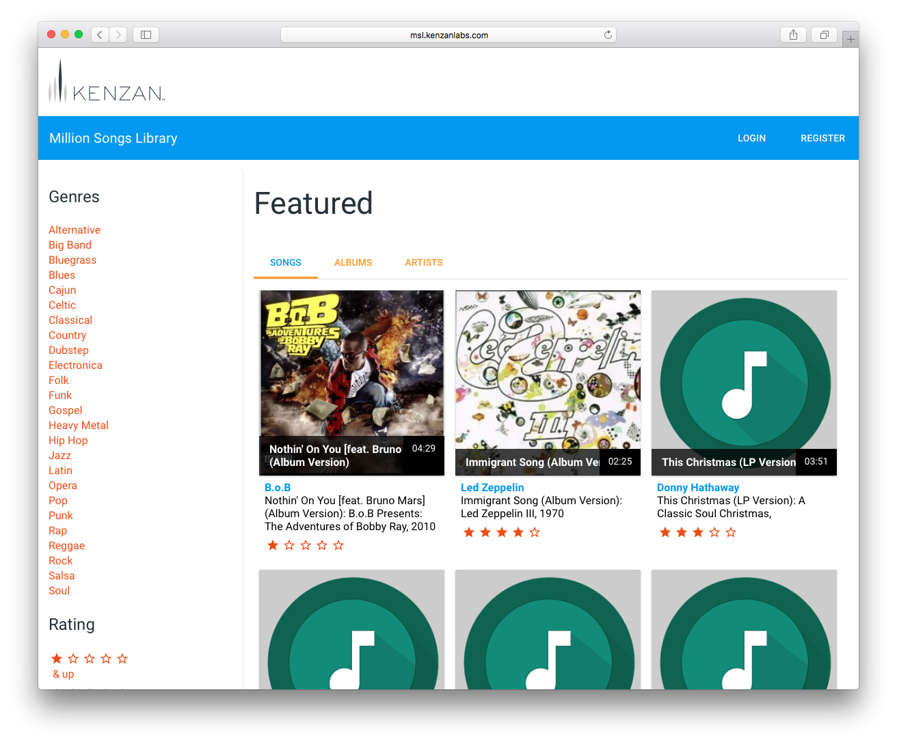

[[setup-mac]]
= Mac OS X Automated Setup
:sectnums:
:icons: font

Follow the steps in this section to set up the Million Song Library demo on a Mac.

[[get-ready-mac]]
== Get Your System Ready

Before setting up the demo, make sure you have everything you need.

Mac OS X 10.11:: We tested this procedure on Mac OS X 10.11 (El Capitan). https://support.apple.com/en-us/HT201260[Check your OS X version^] to see if you're already running El Capitan. If you're running an older version of OS X, you should https://support.apple.com/en-us/HT201475[upgrade your Mac to El Capitan^].

Apple Xcode:: On Mac OS X, some necessary command line tools aren't installed by default, so to get them you'll need to https://developer.apple.com/xcode/download/[install the latest version of Xcode from the Mac App Store^].
+
NOTE: After installation, make sure to open Xcode, accept the license agreement, and (if prompted) install any additional tools.

Java 1.8 JDK:: Install the http://www.oracle.com/technetwork/java/javase/downloads/jdk8-downloads-2133151.html[Java 1.8 JDK^]. Make sure to select the *Mac OS X x64* download option. To install, just double-click the DMG file to open it, and then double-click the installer.

Git:: Install Git if you don't have it already. One easy method is to http://git-scm.com/downloads[download the Mac OS X installer^]. To install, just double-click the DMG file to open it, and then double-click the installer.

Terminal:: You'll need a terminal application so you can enter commands at the command prompt. The Terminal app included with Mac OS X will work just fine. You can find it in *Applications->Utilities*.

====
*Where is My Home Directory?*

For this process, it's important to know where your home directory is. Your home directory is the directory that has the same name as your user name.

For example, if the user name you use to log on to your Mac is jdoe, your home directory is named *jdoe*. In Terminal, your home directory is represented by the tilde (~) sign. For example, the path *~/stuff* points to a directory named *stuff* located inside your home directory.
====

[[update-tools-mac]]
== Update Existing Tools (If Needed)

The Million Song Library setup script will automatically install the required tools and frameworks, so in most cases there's nothing more you need to install before getting started. There's one exception--if you already have some of the required tools installed on your system, then you need to make sure they are at the required version. Check the list below.

Maven 3.3.9 or later:: To see what version of Maven is installed, enter `mvn -version` at the command prompt. If you get the message `command not found`, it means Maven is not installed, and there's no need to do anything.
+
If the command reports that an older version is installed, http://www.tutorialspoint.com/maven/maven_environment_setup.htm[upgrade your Maven installation^] to version 3.3.9 or later.

Node 0.12.x or later:: To see what version of Node is installed, enter `node --version` at the command prompt. If you get the message `command not found`, it means Node is not installed, and there's no need to do anything.
+
If the command reports that an older version is installed, https://nodejs.org/en/download/[download the Node.js Mac OS X installer^]. Just double-click the installer to run it. This will also install npm.

npm 2.7.x or later:: To see what version of npm is installed, enter `npm -version` at the command prompt. If you get the message `command not found`, it means npm is not installed, and there's no need to do anything.
+
If the command reports that an older version is installed, https://nodejs.org/en/download/[download the Node.js Mac OS X installer^], which includes npm. Just double-click the installer to run it.

== Enable the Root User

On Mac OS X, the root user is not enabled by default, so you'll need to enable it so the setup script runs properly. To enable the root user, just https://support.apple.com/en-us/HT204012[follow these instructions^].

== Clone the MSL Repository

To run the setup script, you first need to clone the million-song-library repository to a local directory.

. Open a new Terminal window and enter the following command:
+
----
git clone https://github.com/kenzanmedia/million-song-library
----
+
Git creates a directory called *million-song-library* inside your home directory, and checks out a working copy of the repository.
+
. Enter the following command to change directories to the cloned repository:
+
----
cd million-song-library
----
+
. Enter the folowing command to initialize the repository and submodules:
+
----
git submodule init && git submodule update
----

[[start-cassandra-mac]]
== Install and Start Cassandra

Now let's get Cassandra up and running.

. Download Cassandra 2.1.11 (Community version) from the https://downloads.datastax.com/community/[Datastax download site^].
+
NOTE: Make sure to download the correct file: *dsc-cassandra-2.1.11-bin.tar.gz*
. Create a new directory named *cassandra* inside your home ( *~/* ) directory.
. Move the *dsc-cassandra-2.1.11-bin.tar.gz* file into the *~/cassandra* directory, and then double-click the file to extract it.
. To start Cassandra, open a new Terminal window and enter the following command:
+
----
sh ~/cassandra/dsc-cassandra-2.1.11/bin/cassandra
----

== Run the Setup Script

Now that Cassandra is running, you're ready to run the setup script.

. In Terminal, press *Command+T* to open a new tab.
. Enter the following command to change to the script directory:
+
----
cd ~/million-song-library/common
----
. Enter the following command to make the setup script executable:
+
----
chmod +x setup.sh
----
. Enter the following command to run the setup script:
+
----
./setup.sh -c ~/cassandra/dsc-cassandra-2.1.11 -n -s -g
----
+
NOTE: Watch the script output -- you will be prompted to press *<Enter>* and also to enter your administrator password.
. Wait for the script to complete (about 30 minutes).

NOTE: It's normal to see some warnings while the script runs. If the script encounters an error that prevents it from finishing, make sure you installed all the required tools. See <<get-ready-mac>> and <<update-tools-mac>> above. Then try running the script again.

[[start-msl-mac]]
== Start the MSL Demo

Setup is complete -- now it's time to start the Million Song Library demo.

. In Terminal, press *Command+T* to open another new tab.
. Enter the following command to change to the application directory: 
+
----
cd ~/million-song-library/msl-pages
----
. Enter the following command to start the application front end:
+
----
npm run full-dev
----
+
Wait for the front end to start up -- this will take just a couple of minutes.
. In Terminal, press *Command+T* to open another new tab. You should still be in the *msl-pages* directory.
. Enter the following command to start the server instances:
+
----
sudo npm run serve-all
----
+
Wait for the server instances to start up -- again, this will take just a couple of minutes.
. Open a Web browser and point it to: *msl.kenzanlabs.com:3000*
+
The Million Song Library home page displays. (If you don't see data right away, wait a couple of minutes and then refresh the page.)
+

ifeval::["{output}"=="html"]
.Million Song Library Home Page

endif::[]

ifeval::["{output}"=="pdf"]
.Million Song Library Home Page

endif::[]

Now that the Million Song Library demo is working, here are some fun things to try:

* Click *Register* to register for an account.
* Click the labels to switch the view between *Songs*, *Albums*, and *Artists*.
* Click a genre or star rating on the left to filter songs. (Click the *x* to clear a filter.)
* Mouse over a song and click *Add to library* to add it to your music library (you must be logged in).
* Click the stars below a song to rate it (you must be logged in).

== Stop the MSL Demo
Done having fun for now? Follow these steps to stop the Million Song Library demo.

. In Terminal, switch to the tab where you started the server instances and press *Control+C* to stop the server.
. In Terminal, switch to the tab where you started the application and press *Control+C* to stop the application.
. In Terminal, switch to the tab where you started Cassandra and enter the following command:
+
----
ps auwx | grep cassandra
----
+
Look at the output from the command and note the first 3&#8211;5 digit number that appears in the output. This is the process ID for Cassandra.
. Enter the following command where *pid* is the process ID you found (you'll be prompted for your administrator password):
+
----
sudo kill pid
----

NOTE: You don't need to run the setup script if you want to start the Million Song Library demo again. Just start Cassandra (see <<start-cassandra-mac>>) and then start the application and server instances (see <<start-msl-mac>>).
