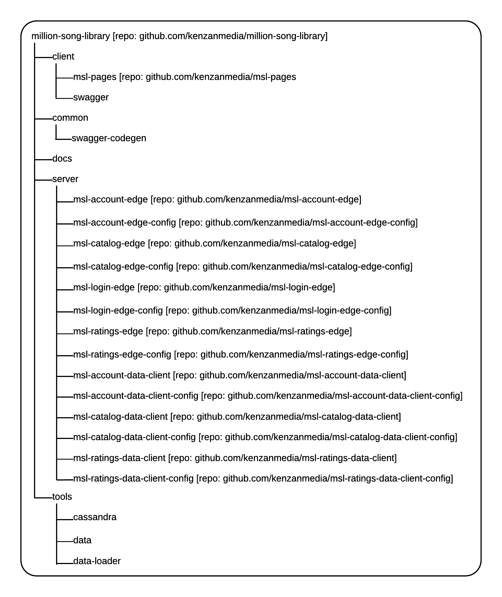

= Code and Documentation
:sectnums:
:icons: font

The Million Song Library project is open source and hosted on GitHub. The code is written using common coding standards. And it's fully documented with the help of automated documentation tools.

== GitHub Repositories

You can find all of the source code for the Million Song Library project in the master repository on GitHub.

****
http://github.com/kenzanmedia/million-song-library[^]
****

The master repository includes multiple sub-repositories that have been added as Git submodules using the `git submodule add` command. There is one submodule for each service, configuration, and UI service. Dividing the project into submodules like this makes it easier to configure https://en.wikipedia.org/wiki/Continuous_integration[continuous integration^] (CI) jobs. It also provides a cleaner separation of responsibilities within the code. At the same time, having one master repository means that it's simple to retrieve the entire project all at once.

ifeval::["{output}"=="html"]
.Million Song Library Repository Structure

endif::[]

ifeval::["{output}"=="pdf"]
.Million Song Library Repository Structure

endif::[]

== Coding Standards

We think the Google coding standards and style guides are concise and useful, so we based our own style guide on them. We wrote all of the code in the Million Song Library project to conform to these standards. See the https://github.com/kenzanmedia/styleguide[Kenzan Style Guide^] to learn more.

== Documentation Tools

The Million Song Library project leverages a number of tools to generate API, code, and other documentation.

=== Swagger API Documentation and Code Generation 

We use the open-source http://github.com/swagger-api[Swagger framework^] to create the API documentation right alongside the client and server code. Swagger provides more than just a way to document as you develop because the documentation actually drives code generation. Using the Swagger codegen tools, you can generate client libraries and server stubs from the same definition file used to generate the documentation. By unifying the generation of the API documentation with the application code, Swagger assures that they always stay in sync. And it enables publishing of the API documentation to both static and interactive formats.

NOTE: Recently, Swagger was donated to the Open API Initiative and was renamed the https://github.com/OAI/OpenAPI-Specification[OpenAPI Specification^].

To use Swagger, we first specify the API methods and models in multiple https://en.wikipedia.org/wiki/YAML[YAML files^] and combine them as necessary:

* *definitions.yaml* - (One file) Declares all of the objects that will be passed into and out of the APIs.
* *paths.yaml* -  (One file for each microservice) Declares the API methods for that microservice.
* *index.yaml* - (One file for each microservice) Uses `$ref` commands to combine certain other YAML files to completely define the API for that microservice.
* *index.yaml* - (One file) Combines all of the API methods and models into a single file that is used to generate documentation for all API methods in all microservices.

Next, to generate documentation and server-side code stubs, we use JavaScript (*resolve.js*) to resolve the `$ref` commands and output the final YAML files. The final YAML files are sent through Swagger (*swagger-client-cli*) to build the server-side code stubs and the HTML API documentation.

TIP: For an example of static documentation generated with Swagger, see link:swagger/index.html[this static HTML representation^]. For instructions on how to run the Swagger mock server and view the interactive documentation, see the "`Swagger`" section in the https://github.com/kenzanmedia/msl-pages[README for the msl-pages sub-repository^].

=== Javadoc and ESDoc

To generate documentation for the server Java classes, we use the open-source http://www.oracle.com/technetwork/articles/java/index-jsp-135444.html[Javadoc tool^]. Information about each class, including its parameters and return object or value, is added to the code by means of standard comments. HTML or PDF documentation can then be generated from the code comments using command line tools. A number of popular IDEs also offer tools for generating JavaDocs.

Similarly, we use https://esdoc.org/[ESDoc^] to create code documentation for the JavaScript functions and methods that are part of the UI service.

=== AsciiDoc Documentation

We use http://asciidoc.org/[AsciiDoc^] to create supplemental documentation for the Million Song Library project (including the document you're reading now).

AsciiDoc is a text-based markup language for writing documentation such as articles, books, and more. Like other lightweight markup languages, AsciiDoc has a simple syntax that is human readable. Using open source tools, text files written in AsciiDoc can be easily processed to create output in a variety of formats, including HTML and PDF.